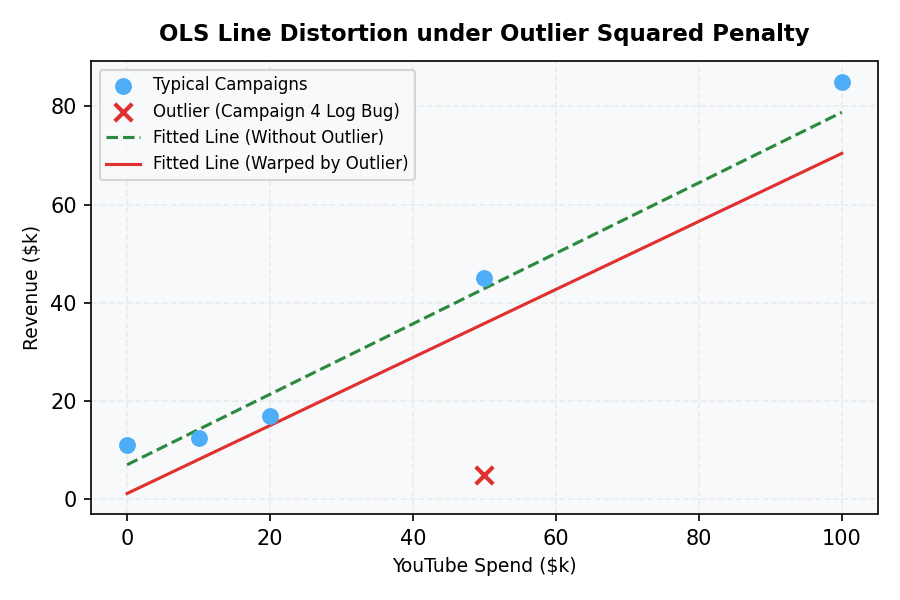

# Notation and Cost Function Intuition

In applied machine learning engineering, having a clean, standardized notation is critical for writing bug-free vectorized code. This guide introduces the core mathematical framework for linear regression and explains the conceptual mechanics of the cost function, balancing theoretical definitions with concrete production scenarios.

---

## 1. The Mathematical Framework

To implement linear regression efficiently at scale, we represent features and parameters as vectors. We follow Andrew Ng's updated notation:

- Let $x$ be a single training example represented as an input feature vector of dimension $n$:
  $$x = \begin{bmatrix} x_1 \\ x_2 \\ \vdots \\ x_n \end{bmatrix} \in \mathbb{R}^n$$
- Let $w$ be the weights vector of dimension $n$, matching the dimensionality of the features:
  $$w = \begin{bmatrix} w_1 \\ w_2 \\ \vdots \\ w_n \end{bmatrix} \in \mathbb{R}^n$$
- Let $b$ be the bias scalar (the intercept term):
  $$b \in \mathbb{R}$$

### The Prediction Function
The prediction for a single input example $x$ is defined in vector notation as:
$$f_{w,b}(x) = w \cdot x + b$$

Where $w \cdot x$ is the vector dot product, representing the linear combination of features:
$$w \cdot x = \sum_{j=1}^{n} w_j x_j = w_1 x_1 + w_2 x_2 + \dots + w_n x_n$$

---

## 2. Production Scenario: Marketing Revenue Prediction

To ground this notation, imagine you are an ML Engineer at an e-commerce company. You need to build a model that predicts **Ad Campaign Revenue (in thousands of USD)** based on advertising spend across three channels: YouTube, Facebook, and Google Search.

### The Toy Dataset ($m = 5$ historical campaigns)

| Campaign ($i$) | YouTube ($x_1$) | Facebook ($x_2$) | Google Search ($x_3$) | Revenue ($y$) |
| :--- | :--- | :--- | :--- | :--- |
| 1 | \$10k | \$5k | \$2k | **\$12.5k** |
| 2 | \$20k | \$2k | \$10k | **\$17.0k** |
| 3 | \$0k | \$10k | \$5k | **\$11.0k** |
| 4 | \$50k | \$15k | \$20k | **\$45.0k** |
| 5 | \$100k | \$25k | \$50k | **\$85.0k** |

### Step-by-Step Prediction Calculation
Suppose our model has learned the following weights and bias:
$$w = \begin{bmatrix} 0.50 \\ 0.80 \\ 0.20 \end{bmatrix}, \quad b = 3.5$$

Let's calculate the predicted revenue for **Campaign 1** ($x^{(1)} = [10, 5, 2]^T$):
$$f_{w,b}(x^{(1)}) = w \cdot x^{(1)} + b$$
$$f_{w,b}(x^{(1)}) = (0.50 \times 10) + (0.80 \times 5) + (0.20 \times 2) + 3.5$$
$$f_{w,b}(x^{(1)}) = 5.0 + 4.0 + 0.4 + 3.5 = 12.9$$

Our model predicts a revenue of **\$12.9k** for Campaign 1, compared to the actual target of **\$12.5k**. The prediction error is:
$$\text{Error} = f_{w,b}(x^{(1)}) - y^{(1)} = 12.9 - 12.5 = 0.4 \quad (\$400)$$

---

## 3. Engineering Vectorization: Why We Avoid Loops

In an academic setting, linear regression is often written with explicit loops:
$$\text{prediction} = b + \sum_{j=1}^{n} w_j x_j$$

In a production environment, implementing this via a `for` loop in Python is a critical anti-pattern. Vectorization utilizes hardware-level parallelism to accelerate computation.

### Hardware-Level Parallelism
When computing $w \cdot x$, modern CPUs and GPUs leverage several acceleration techniques:
1. **SIMD (Single Instruction, Multiple Data):** CPU instruction sets (e.g., AVX-512, NEON) load multiple elements of the $w$ and $x$ arrays into wide vector registers and execute a multiply-accumulate operation in a single clock cycle.
2. **Cache Line Alignment:** Vectorized libraries (like NumPy/MKL or BLAS) access memory contiguously. A `for` loop in an interpreted language (like Python) incurs massive overhead due to type-checking, pointer chasing, and cache misses.
3. **Thread-Level Parallelism:** For large batch predictions, dot products are scaled to matrix multiplications ($X w + b$), which are split across multiple CPU cores or GPU warps.

### Code Comparison (Python/NumPy)

```python
import numpy as np
import time

# Simulate n = 1,000,000 features
n = 1_000_000
w = np.random.randn(n)
x = np.random.randn(n)
b = 0.5

# --- Anti-Pattern: Iterative Looping ---
start_loop = time.perf_counter()
prediction_loop = b
for j in range(n):
    prediction_loop += w[j] * x[j]
end_loop = time.perf_counter()

# --- Best Practice: Vectorized Dot Product ---
start_vec = time.perf_counter()
prediction_vec = np.dot(w, x) + b
end_vec = time.perf_counter()

print(f"Loop implementation: {end_loop - start_loop:.6f} seconds")
print(f"Vectorized implementation: {end_vec - start_vec:.6f} seconds")
# Vectorized implementation is typically 150x to 300x faster in Python
```

---

## 4. The Cost Function $J(w,b)$ and Outlier Intuition

To evaluate how well our model fits the dataset of $m$ campaigns, we define the Mean Squared Error (MSE) cost function:

$$J(w,b) = \frac{1}{2m} \sum_{i=1}^{m} \left( f_{w,b}(x^{(i)}) - y^{(i)} \right)^2$$

Where:
- $x^{(i)}$ is the feature vector of the $i$-th campaign.
- $y^{(i)}$ is the true revenue target of the $i$-th campaign.
- $m$ is the total number of campaigns.
- The factor of $\frac{1}{2}$ is a mathematical convenience that cancels the exponent when calculating gradients.

### Conceptual Intuition: Why Square the Errors?
By squaring the difference, we disproportionately penalize larger errors.

#### Scenario: The Outlier Campaign
Imagine Campaign 4 suffered a logging bug: we spent \$50k YouTube, \$15k Facebook, \$20k Google ($f_{w,b}(x^{(4)}) = 44.5$), but the recorded revenue was only **\$5.0k** (instead of \$45.0k).
- For a typical error of $0.4$ (like Campaign 1), the squared error is:
  $$\text{SE}_{\text{normal}} = (0.4)^2 = 0.16$$
- For the outlier campaign, the error is $44.5 - 5.0 = 39.5$. The squared error is:
  $$\text{SE}_{\text{outlier}} = (39.5)^2 = 1560.25$$

**The Engineering Impact:** The outlier campaign's squared error of **1560.25** is nearly **10,000 times larger** than the normal campaign's error of 0.16. During training, the OLS optimizer will aggressively warp the weights vector $w$ just to minimize this single error, ruining the fit for the other 4 normal campaigns.



### The Convex "Bowl" Shape
Because $J(w,b)$ is a quadratic function, its second derivative (Hessian matrix) is positive semi-definite. Geometrically, this means $J(w,b)$ is a **convex function** (a bowl shape).

```
          J(w,b) 
            \          /
             \        /
              \      /   <-- Convex Bowl Shape
               \____/
                 ^
           Global Minimum (Single Best Solution)
```

**Engineering Implication:** Convexity guarantees that there is **exactly one** global minimum. When optimizing using gradient descent, there are no local minima traps where the optimizer can get stuck in a suboptimal state. Any local minimum we find is guaranteed to be the global minimum, ensuring mathematical stability during model optimization.
