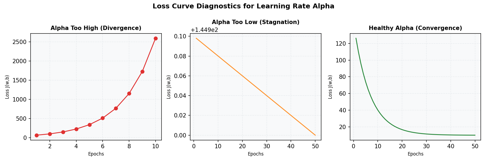

# Optimization and Trade-offs

Once we have defined the model $f_{w,b}(x)$ and cost function $J(w,b)$, we must find the parameters $w$ and $b$ that minimize $J(w,b)$. This guide details the mathematics and engineering tradeoffs of **Gradient Descent** (an iterative method) and the **Normal Equation** (an analytical closed-form solution).

---

## 1. Gradient Descent Optimization

Gradient Descent updates parameters by moving in the direction of steepest descent (opposite to the gradient of the cost function).

### Update Rules
For each iteration, the parameters $w$ and $b$ are updated simultaneously:

$$w_j = w_j - \alpha \frac{\partial J(w,b)}{\partial w_j} \quad \text{for } j = 1, \dots, n$$
$$b = b - \alpha \frac{\partial J(w,b)}{\partial b}$$

Plugging in the partial derivatives of the MSE cost function:

$$\frac{\partial J(w,b)}{\partial w_j} = \frac{1}{m} \sum_{i=1}^{m} \left( f_{w,b}(x^{(i)}) - y^{(i)} \right) x_j^{(i)}$$
$$\frac{\partial J(w,b)}{\partial b} = \frac{1}{m} \sum_{i=1}^{m} \left( f_{w,b}(x^{(i)}) - y^{(i)} \right)$$

### Vectorized Update Rule
In practice, we update the entire weights vector $w$ at once using matrix operations:

$$w = w - \alpha \frac{1}{m} X^T \left( f_{w,b}(X) - y \right)$$

Where:
- $X$ is the $m \times n$ design matrix of features.
- $f_{w,b}(X)$ is the $m \times 1$ vector of predictions.
- $y$ is the $m \times 1$ vector of ground truth labels.

---

## 2. Debugging the Learning Rate $\alpha$ in Production

The learning rate $\alpha$ controls the step size taken towards the minimum. Setting $\alpha$ incorrectly is a common training bug. You can diagnose this by plotting the **Learning Curve** (Training Loss vs. Iterations) or inspecting training logs.

### Case A: Learning Rate $\alpha$ is Too High (Divergence / Oscillation)
- **Visual Symptom:** The training loss curve oscillates violently or steadily increases (diverges to infinity).
- **Mathematical Intuition:** The step size is so large that it overshoots the minimum and lands on the opposite side of the "bowl" at a higher point.
- **Production Logs:**
  ```text
  [Epoch 01] Train Loss: 45.2104
  [Epoch 02] Train Loss: 892.4182
  [Epoch 03] Train Loss: 18234.1129
  [Epoch 04] Train Loss: 374921.9021
  [Epoch 05] Train Loss: NaN
  RuntimeError: Loss diverged to NaN. Check learning rate.
  ```
- **Fix:** Scale down $\alpha$ by a factor of 3 or 10 ($0.1 \rightarrow 0.01$).

### Case B: Learning Rate $\alpha$ is Too Low (Stagnation)
- **Visual Symptom:** The training loss decreases in a straight line or barely drops over thousands of steps.
- **Mathematical Intuition:** The steps are infinitesimally small, requiring excessive computational time to reach the minimum.
- **Production Logs:**
  ```text
  [Epoch 001] Train Loss: 145.2104
  [Epoch 002] Train Loss: 145.2098
  [Epoch 003] Train Loss: 145.2091
  ...
  [Epoch 100] Train Loss: 145.1504 (Stagnant, target threshold of 10.0 not reached)
  ```
- **Fix:** Increase the learning rate (e.g., $0.0001 \rightarrow 0.005$) or implement an adaptive optimizer (like Adam).



---

## 3. The Normal Equation (Analytical Closed-Form Solution)

Instead of iteratively stepping toward the minimum, the Normal Equation solves for the optimal parameters analytically in a single step.

### Design Matrix Layout
To express the Normal Equation cleanly, we combine the bias $b$ and weights $w$ into a single parameter vector $\theta$, and prepend a column of ones to our design matrix $X$:

- Let $\theta = \begin{bmatrix} b \\ w_1 \\ \vdots \\ w_n \end{bmatrix} \in \mathbb{R}^{n+1}$
- Let $X$ be the $m \times (n+1)$ design matrix where the first column is all $1$s:
  $$X = \begin{bmatrix} 1 & x_1^{(1)} & \dots & x_n^{(1)} \\ 1 & x_1^{(2)} & \dots & x_n^{(2)} \\ \vdots & \vdots & \ddots & \vdots \\ 1 & x_1^{(m)} & \dots & x_n^{(m)} \end{bmatrix}$$

The optimal parameter vector $\theta$ is solved via:
$$\theta = (X^T X)^{-1} X^T y$$

---

## 4. Production Trade-offs: Gradient Descent vs. Normal Equation

| Feature / Scenario | Gradient Descent | Normal Equation |
| :--- | :--- | :--- |
| **Optimization Method** | Iterative (requires convergence checks) | Closed-Form (single analytical step) |
| **Hyperparameter Tuning** | Requires choosing learning rate $\alpha$, batch size, and iterations | No hyperparameters to tune |
| **Computational Complexity** | $O(k \cdot m \cdot n)$ (where $k$ is iterations) | $O(n^3)$ due to calculating the matrix inverse $(X^T X)^{-1}$ |
| **Scalability (Features $n$)** | Scales exceptionally well to large $n$ ($n > 100,000$) | Fails at large $n$ due to computational cost and memory footprints of inversion |
| **Scalability (Samples $m$)** | Scales well. Out-of-core learning is possible via Mini-batch GD | Requires loading all $m$ examples into memory |
| **Feature Scaling** | **Mandatory.** Elongated cost contours cause training to fail | **Not required.** The closed-form solution is scale-invariant |

---

## 5. Non-Invertibility of $X^T X$: The Dummy Variable Trap

In production code, trying to solve the Normal Equation can crash your pipeline with a `Singular Matrix Error` (i.e., $X^T X$ is not invertible). 

### The 2 Main Causes
1. **Multicollinearity (Redundant Features):** If you one-hot encode both categorical flags (e.g., `Desktop` and `Mobile`) alongside a bias intercept column. Since `Desktop + Mobile = 1` (the constant column), the matrix is rank-deficient.
2. **Too Few Rows ($m \le n$):** Having fewer training rows than features (e.g., predicting LTV with 10 rows of historical customer data but 100 features).

### Code Demonstration and Fixes (Before-and-After)

```python
import numpy as np

# Simulate perfect multicollinearity (Bias, Desktop, Mobile)
X = np.array([[1, 1, 0],
              [1, 0, 1],
              [1, 1, 0],
              [1, 0, 1]])
y = np.array([12.5, 17.0, 11.0, 45.0])

# --- VIOLATION: Inversion fails ---
try:
    XTX = np.dot(X.T, X)
    theta = np.dot(np.linalg.inv(XTX), np.dot(X.T, y))
except np.linalg.LinAlgError as e:
    print(f"CRITICAL PIPELINE ERROR: {e}") # Singular matrix

# --- FIX 1: Drop one categorical column (Desktop) to break dependency ---
X_fixed = np.array([[1, 0],  # Bias, Mobile
                    [1, 1],
                    [1, 0],
                    [1, 1]])
XTX_fixed = np.dot(X_fixed.T, X_fixed)
theta_fixed = np.dot(np.linalg.inv(XTX_fixed), np.dot(X_fixed.T, y))
print("Solved Weights (Drop Column):", theta_fixed)

# --- FIX 2: Inject Ridge Regularization (lambda = 0.1) ---
# Adding value along the diagonal shifts the eigenvalues, guaranteeing invertibility
lam = 0.1
XTX_regularized = XTX + lam * np.eye(XTX.shape[0])
theta_regularized = np.dot(np.linalg.inv(XTX_regularized), np.dot(X.T, y))
print("Stabilized Weights (Ridge):", theta_regularized)
```
