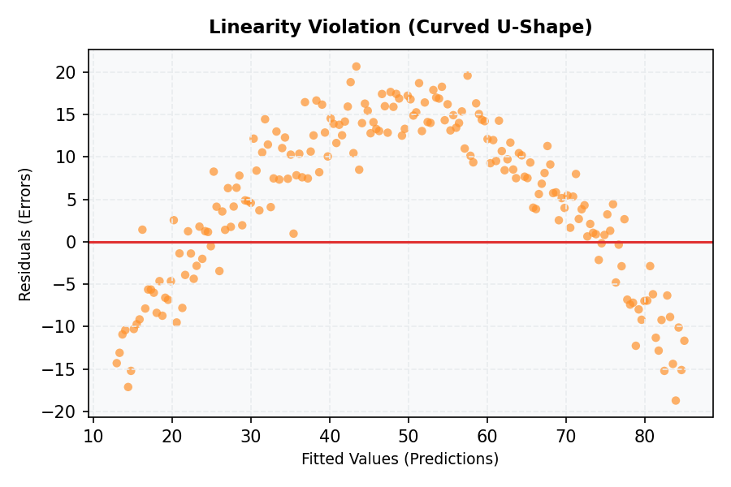
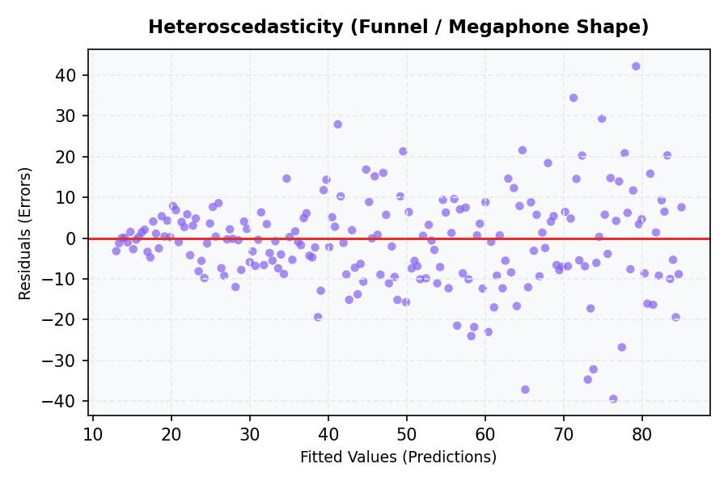
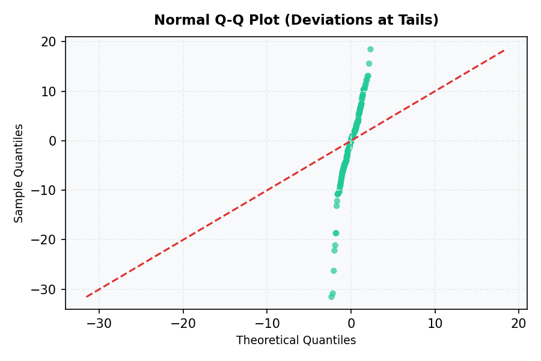
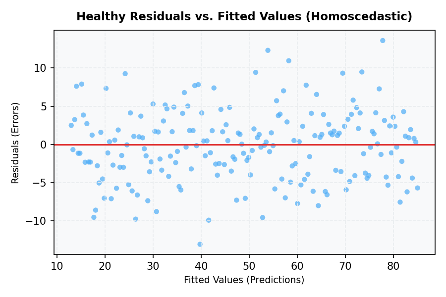

# Assumptions and Diagnostics

For linear regression predictions to be stable and for its coefficients to be interpretable, the underlying data must satisfy several statistical assumptions. In production, violating these assumptions leads to unstable predictions and inflated errors on unseen data. This guide demonstrates how to visually diagnose and fix these violations using a concrete sales forecasting scenario.

---

## 1. The 5 Core Assumptions and Visual Diagnostics

Instead of relying on rigid academic hypothesis tests, applied ML engineers use **visual diagnostic plots** and metrics to identify model issues.

### 1. Linearity
- **What it means:** The relationship between features $x$ and target $y$ is linear.
- **Diagnostic:** **Residuals vs. Fitted plot**. The residuals (errors) should be randomly scattered around the horizontal line $y=0$ with no clear curve (e.g., U-shape).
- **Visual Representation:**
  
- **Production Fix:** Apply non-linear transformations to features (e.g., $x^2$, $\log(x)$, $\sqrt{x}$) or feature crossings.

### 2. Independence of Residuals (No Autocorrelation)
- **What it means:** The residuals of one prediction should not depend on the residuals of another. Crucial for time-series or spatial datasets.
- **Diagnostic:** **Residuals vs. Time/Row Index plot**. You should see a random scatter. Wave-like patterns indicate autocorrelation. Standard statistics include the Durbin-Watson test (values near 2.0 indicate independence).
- **Production Fix:** Introduce lagged features ($y_{t-1}$) or use time-series-specific models (e.g., ARIMA or temporal features) rather than standard OLS.

### 3. Homoscedasticity (Constant Variance of Residuals)
- **What it means:** The variance of the residuals must remain constant across all levels of predictions.
- **Diagnostic:** **Residuals vs. Fitted plot**. Look for a "funnel" or "megaphone" shape where the scatter of residuals spreads out wider as the predicted value increases.
- **Visual Representation:**
  
- **Production Fix:** Apply a log-transform (e.g., `np.log1p()`) or power transform to the target variable $y$ to compress the scale of large values. Alternatively, use Weighted Least Squares (WLS).

### 4. Normality of Residuals
- **What it means:** The residuals (errors) should be normally distributed. Note that the *features* do not need to be normal; only the *errors* do.
- **Diagnostic:** **Quantile-Quantile (Q-Q) Plot**. The plotted points should lie along a straight diagonal $45$-degree line. Deviations at the tails indicate heavy-tailed distributions or outliers.
- **Visual Representation:**
  
- **Production Fix:** Transform highly skewed target/features or remove extreme training outliers.

### 5. No Multicollinearity
- **What it means:** The features $x_j$ must not be highly correlated with one another.
- **Diagnostic:** Variance Inflation Factor (VIF). A feature with a $\text{VIF} > 5$ or $10$ indicates high multicollinearity.
  $$VIF_j = \frac{1}{1 - R_j^2}$$
  Where $R_j^2$ is the coefficient of determination when regressing feature $x_j$ against all other features.
- **Production Fix:** Drop one of the highly correlated features or apply $L_2$ regularization (Ridge Regression), which stabilizes coefficients.

---

## 2. Production Scenario: Predicting Retail Store Sales

Imagine you are forecasting daily sales revenue ($y$) for a retail store chain based on daily temperature ($x_1$, in Celsius) and marketing campaign status ($x_2$, binary).

### Visualizing the Violation: Heteroscedasticity (Funnel Pattern)
If you plot the residuals ($y - \hat{y}$) against the fitted (predicted) sales values, you see a "funnel" pattern:


*   **The Scenario Context:** On cool days, sales are stable and easy to predict (small residual spread). On hot days, customers might purchase huge volumes of cold beverages, or stay home entirely, causing the sales variance to explode (large residual spread).
*   **The Danger:** The OLS optimizer will over-index on fitting the high-variance hot days, leading to poor prediction performance on typical days.

### Before-and-After Implementation: Resolving the Violation

```python
import numpy as np
import pandas as pd
import statsmodels.api as sm
from statsmodels.stats.outliers_influence import variance_inflation_factor

# Simulate heteroscedastic sales data
np.random.seed(42)
temp = np.linspace(10, 40, 100)
sales = 100 + 5 * temp + np.random.normal(0, 0.5 * temp**2)  # Variance scales with temperature
df = pd.DataFrame({'temp': temp, 'sales': sales})

# --- VIOLATION: Fit on raw Sales ---
X = sm.add_constant(df['temp'])
model_raw = sm.OLS(df['sales'], X).fit()
residuals_raw = model_raw.resid

# --- RESOLUTION: Log Transform target Sales ---
df['log_sales'] = np.log1p(df['sales'])  # log(sales + 1) to handle zeros safely
model_logged = sm.OLS(df['log_sales'], X).fit()
residuals_logged = model_logged.resid
# The plot of residuals_logged against fitted values will now show a stable, homoscedastic ribbon:
# 

# --- DIAGNOSING MULTICOLLINEARITY (VIF) ---
# Calculate VIF for each feature
features_to_check = df[['temp', 'log_sales']]
vif_data = pd.DataFrame()
vif_data["feature"] = features_to_check.columns
vif_data["VIF"] = [variance_inflation_factor(features_to_check.values, i) for i in range(len(features_to_check.columns))]
print(vif_data)
# If VIF > 5.0, one of the columns should be dropped to prevent weight instability.
```

---

## 3. Applied Feature Selection: What does $p < 0.05$ Mean?

When training OLS models, each feature $x_j$ is assigned a $p$-value. Under the null hypothesis, we assume that feature $x_j$ has no linear relationship with the target (i.e., its true weight $w_j = 0$).

A $p$-value of **$< 0.05$** means:
> **"If the feature truly had zero effect, the probability of observing a coefficient as large as ours by pure random chance is less than 5%."**

Therefore, we reject the null hypothesis and conclude the feature has a statistically significant linear association with the target.

### The Large-$m$ Trap in Production
If your production dataset has millions of rows ($m \rightarrow \infty$), the standard error of your coefficients shrinks to near zero. Consequently, **every feature**—even complete noise with a tiny correlation—will have a $p$-value of $0.000$ and register as "statistically significant."
- **Engineering Rule:** When working with big data, ignore $p$-values for feature selection. Focus instead on **effect size** (the magnitude of $w_j$) and validation set loss changes when the feature is removed.
