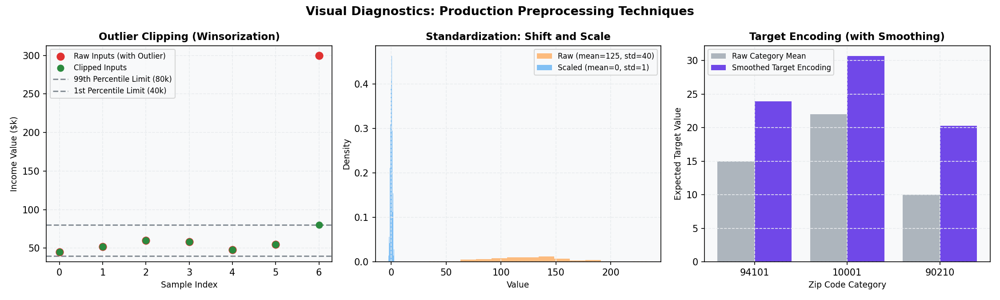

# Production Scenarios and Pipeline Engineering

Deploying linear regression models to production environments requires moving past academic assumptions and addressing data layout and pre-processing engineering. This guide covers industry use cases, data engineering principles, and a complete post-mortem case study.

---

## 1. Industry Use Cases: Why OLS is Still King

1. **Sub-Millisecond Ad-Tech Inferences:**
   In programmatic ad bidding, models must predict click-through rates (CTR) within 5 milliseconds. Running a neural network or tree ensemble is too computationally expensive. A vectorized dot product ($w \cdot x + b$) compiles to raw CPU register instructions, running in single-digit microseconds.
2. **Fair Lending Act Compliance:**
   Under fair lending regulations, if an automated system rejects a loan applicant, the system must generate legally auditable "Adverse Action Notices." A linear model's coefficients are completely deterministic, making compliance audits trivial compared to deep learning models.

---

## 2. Production Preprocessing Pipelines

In a production environment, a machine learning pipeline must process incoming, raw, noisy data streams without crashing, violating latency SLAs, or introducing data leakage.

### The 4 Pillars of Linear Regression Preprocessing

#### 1. Feature Scaling (Standardization)
- **Why it matters:** OLS optimization via Gradient Descent converges faster when features are scaled because it makes the cost contour map spherical.
- **The Equation:** For feature $x$:
  $$x_{\text{scaled}} = \frac{x - \mu_{\text{train}}}{\sigma_{\text{train}}}$$
- **Production Hazard:** Never compute the mean $\mu$ and standard deviation $\sigma$ on the incoming inference batch. You must use the fixed $\mu_{\text{train}}$ and $\sigma_{\text{train}}$ calculated during model training.

#### 2. Target Encoding (with Smoothing)
- **Why it matters:** Categorical features with thousands of categories (e.g., `user_zipcode`) explode matrix width if one-hot encoded, bloating memory and slowing inferences.
- **The Equation:** Replace category $c$ with a weighted average of the category mean $y_c$ and the global target mean $y_{\text{global}}$:
  $$S_c = \lambda(n_c) y_c + (1 - \lambda(n_c)) y_{\text{global}}$$
  $$\text{where } \lambda(n_c) = \frac{n_c}{n_c + m_{\text{smoothing}}}$$
- Here, $n_c$ is the count of occurrences of category $c$ in the training set, and $m_{\text{smoothing}}$ is the weight given to the global mean (prevents overfitting on rare categories).

#### 3. The Hashing Trick (Feature Hashing)
- **Why it matters:** If the cardinality of a category is growing dynamically (e.g., `user_search_term`), maintaining a lookup dictionary for target encoding becomes memory-prohibitive.
- **How it works:** Apply a fast hash function (like MurmurHash3) to the categorical string and map the output modulo the size of a pre-allocated array (e.g., $1024$ columns):
  $$\text{index} = \text{hash}(x) \pmod N$$
- **Benefit:** Requires no lookup vocabulary, handles new out-of-vocabulary categories automatically, and guarantees a fixed feature size.

#### 4. Outlier Mitigation (Winsorization/Clipping)
- **Why it matters:** OLS is highly sensitive to outliers because it squares errors.
- **How it works:** Define upper and lower bounds during training (e.g., the 1st and 99th percentiles) and clip extreme values during inference:
  $$x_{\text{clipped}} = \max(P_{01}, \min(x, P_{99}))$$

---

### Visualizing Preprocessing Techniques
The following plots illustrate the operations performed by these preprocessing steps:



---

### Concrete Implementation: Train-to-Inference Serialization Pipeline

Here is a complete, production-ready Python example demonstrating how to fit preprocessors on training data, serialize the parameters, and consistently apply them to single-point real-time inferences.

```python
import json
import numpy as np
import pandas as pd

# --- PHASE 1: OFFLINE TRAINING & PARAMETER SERIALIZATION ---

# Simulated training data
train_data = pd.DataFrame({
    'income': [50000.0, 120000.0, 80000.0, 250000.0, np.nan],  # Numeric with missing
    'zipcode': ['94101', '94101', '10001', '10001', '90210'],   # High-cardinality categorical
    'revenue_target': [15.0, 30.0, 22.0, 50.0, 10.0]
})

# Calculate locked preprocessing statistics on training data
income_median = train_data['income'].median()
income_p99 = train_data['income'].quantile(0.99)
income_p01 = train_data['income'].quantile(0.01)

# Fit Standardization parameters
income_non_null = train_data['income'].dropna()
income_mean = income_non_null.mean()
income_std = income_non_null.std()

# Fit Target Encoding with smoothing (smoothing = 2)
global_mean = train_data['revenue_target'].mean()
zip_stats = train_data.groupby('zipcode')['revenue_target'].agg(['count', 'mean'])
smoothing_val = 2.0

zip_encoder = {}
for zipcode, row in zip_stats.iterrows():
    n_c = row['count']
    y_c = row['mean']
    lambda_c = n_c / (n_c + smoothing_val)
    zip_encoder[zipcode] = float(lambda_c * y_c + (1 - lambda_c) * global_mean)

# Save pipeline parameters to a metadata JSON configuration file
pipeline_metadata = {
    "impute_median": float(income_median),
    "scaler_mean": float(income_mean),
    "scaler_std": float(income_std),
    "outlier_p01": float(income_p01),
    "outlier_p99": float(income_p99),
    "target_encoder_zip": zip_encoder,
    "global_mean": float(global_mean)
}

with open("pipeline_metadata.json", "w") as f:
    json.dump(pipeline_metadata, f, indent=4)

print("Pipeline metadata serialized successfully:\n", json.dumps(pipeline_metadata, indent=2))


# --- PHASE 2: ONLINE REAL-TIME SINGLE-POINT INFERENCE ---

# Simulated raw incoming request payload (single dictionary)
incoming_request = {
    "income": 300000.0,   # Outlier value (needs clipping)
    "zipcode": "90210"    # Categorical (needs target encoding)
}

def preprocess_single_inference(request, metadata_path="pipeline_metadata.json"):
    # 1. Load the locked pipeline metadata parameters
    with open(metadata_path, "r") as f:
        meta = json.load(f)
    
    # 2. Extract values
    val_income = request.get("income")
    val_zip = request.get("zipcode")
    
    # 3. Step A: Impute missing values using training median
    if val_income is None or np.isnan(val_income):
        val_income = meta["impute_median"]
    
    # 4. Step B: Clip outliers using training percentiles
    val_income = max(meta["outlier_p01"], min(val_income, meta["outlier_p99"]))
    
    # 5. Step C: Standardize using training mean and std
    standardized_income = (val_income - meta["scaler_mean"]) / meta["scaler_std"]
    
    # 6. Step D: Target Encode categorical zipcode
    # If the zipcode is new (unseen), default to the training global target mean
    encoded_zip = meta["target_encoder_zip"].get(val_zip, meta["global_mean"])
    
    # Return processed feature array ready for model prediction (w.x + b)
    features_vector = np.array([standardized_income, encoded_zip])
    return features_vector

# Preprocess the request consistently
inference_features = preprocess_single_inference(incoming_request)
print("\nInference-ready feature vector (standardized income, encoded zipcode):")
print(inference_features)
```

### Expected Code Execution Output
```text
Pipeline metadata serialized successfully:
 {
  "impute_median": 100000.0,
  "scaler_mean": 125000.0,
  "scaler_std": 88128.69377601524,
  "outlier_p01": 50900.0,
  "outlier_p99": 246099.99999999997,
  "target_encoder_zip": {
    "10001": 30.7,
    "90210": 20.266666666666666,
    "94101": 23.95
  },
  "global_mean": 25.4
}

Inference-ready feature vector (standardized income, encoded zipcode):
[ 1.3741268  20.26666667]
```

### Step-by-Step Mathematical Walkthrough

When the raw incoming dictionary `{"income": 300000.0, "zipcode": "90210"}` is submitted, the pipeline processes the parameters:

1. **Step A: Imputation check**
   - The value `300000.0` is present, so the training median check (`100000.0`) is bypassed.
2. **Step B: Outlier clipping**
   - The income value `300000.0` exceeds the training 99th percentile $P_{99} = 246100.0$.
   - The pipeline clips it:
     $$x_{\text{clipped}} = \min(300000.0, 246100.0) = 246100.0$$
3. **Step C: Standardization**
   - The clipped value `246100.0` is standardized using training parameters ($\mu = 125000.0, \sigma = 88128.69$):
     $$x_{\text{standardized}} = \frac{246100.0 - 125000.0}{88128.69} \approx 1.3741$$
4. **Step D: Smoothed Target Encoding**
   - Zip code `90210` appears exactly once ($n_c = 1$) in the training set with a target mean of $y_c = 10.0$. The global target mean is $y_{\text{global}} = 25.4$.
   - Using $m_{\text{smoothing}} = 2.0$:
     $$\lambda(1) = \frac{1}{1 + 2.0} = \frac{1}{3} \approx 0.3333$$
     $$S_{90210} = (0.3333 \times 10.0) + (0.6667 \times 25.4) = 3.333 + 16.933 = \mathbf{20.2667}$$
   - The raw zipcode string `"90210"` is mapped to its smoothed numerical representation: `20.2667`.

The final array returned `[1.3741, 20.2667]` is directly fed into the OLS weights dot product.

---

## 3. Production Post-Mortem: "The Incident of the Shifting Medians"

### The Incident
An e-commerce company deployed a linear regression model to predict customer lifetime value (LTV). During sales events, customers complained that identical checkout baskets were receiving vastly different discounts and LTV scores. 

### The Root Cause: Dynamic Batch Imputation
The engineering team built a preprocessing step that imputed missing data (e.g., `days_since_last_login`) on-the-fly using the **median of the incoming inference batch**. 
- On normal days, the median was $15$ days.
- During a major promotion, a massive wave of new users logged in (with missing values or 0 days). The batch median shifted to $2$ days.
- Because the imputation value shifted dynamically, a customer's LTV score would change depending on *which other customers* happened to be in the same inference batch, creating batch-dependency and prediction drift.

### Before-and-After Implementation

#### The Bad Code (Dynamic Batch Imputation)

```python
import numpy as np
import pandas as pd

# Simulating incoming production inference batches
batch_normal = pd.DataFrame({'days_since_login': [12.0, 15.0, np.nan, 18.0]})
batch_promo = pd.DataFrame({'days_since_login': [0.0, 1.0, np.nan, 2.0, np.nan]})

# --- ANTI-PATTERN: Imputing using the runtime batch median ---
def preprocess_bad(df):
    batch_median = df['days_since_login'].median()
    df_imputed = df.copy()
    df_imputed['days_since_login'] = df_imputed['days_since_login'].fillna(batch_median)
    print(f"DEBUG: Imputed using batch median = {batch_median}")
    return df_imputed

# An identical NaN profile is filled with different values depending on the batch context
res_normal = preprocess_bad(batch_normal)  # Imputes NaN with 15.0
res_promo = preprocess_bad(batch_promo)    # Imputes NaN with 1.0
```

#### The Good Code (Anchored Imputation)
To fix this, we must calculate the median *only* on the training dataset, serialize this static value as metadata, and lock it in the inference pipeline.

```python
import json
import numpy as np
import pandas as pd

# Training phase: Calculate and anchor the median
train_df = pd.DataFrame({'days_since_login': [10.0, 15.0, 12.0, 20.0, 16.0]})
anchored_median = train_df['days_since_login'].median()  # Locked value = 15.0

# Save to metadata JSON config
metadata = {"days_since_login_median": anchored_median}
with open("model_metadata.json", "w") as f:
    json.dump(metadata, f)

# --- PRODUCTION-SAFE PATTERN: Ingestion pipeline load anchored metadata ---
def preprocess_safe(df, metadata_path="model_metadata.json"):
    with open(metadata_path, "r") as f:
        meta = json.load(f)
    
    impute_value = meta["days_since_login_median"]
    df_imputed = df.copy()
    df_imputed['days_since_login'] = df_imputed['days_since_login'].fillna(impute_value)
    print(f"DEBUG: Imputed using anchored median = {impute_value}")
    return df_imputed

# Both batches now receive consistent imputations (15.0) regardless of the batch composition
res_normal_safe = preprocess_safe(batch_normal)
res_promo_safe = preprocess_safe(batch_promo)
```
