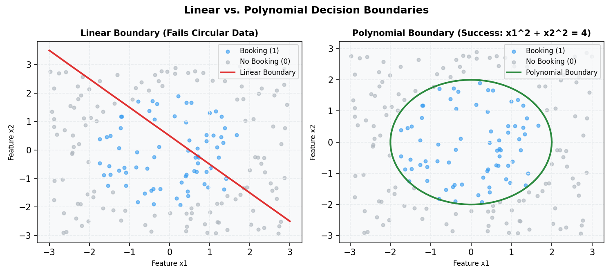

# Decision Boundaries and Assumptions

Unlike linear regression models that output continuous targets, logistic regression outputs a probability. This guide demonstrates how a model maps these probabilities to decision boundaries (both linear and non-linear) and details OLS vs. Logistic Regression assumptions using a concrete spatial classification scenario.

---

## 1. Decision Boundaries

A decision boundary is the geometric region in feature space that separates class $0$ predictions from class $1$ predictions.

### The Standard Threshold
By default, we map the model's output probability $f_{w,b}(x)$ to binary classes using a threshold of $0.5$:
- Predict $\hat{y} = 1$ if $f_{w,b}(x) \ge 0.5$
- Predict $\hat{y} = 0$ if $f_{w,b}(x) < 0.5$

Looking at the sigmoid function $g(z) = \frac{1}{1 + e^{-z}}$:
- $g(z) \ge 0.5 \iff z \ge 0$
- $g(z) < 0.5 \iff z < 0$

Since $z = w \cdot x + b$, this means:
- We predict $1$ when $w \cdot x + b \ge 0$
- We predict $0$ when $w \cdot x + b < 0$

The boundary where the model is completely uncertain ($P=0.5$) is defined by the linear equation:
$$w \cdot x + b = 0$$

---

## 2. Scenario: Ride-Hailing Booking Prediction

You are predicting whether a user opening the app will book a ride ($y=1$) or close the app ($y=0$) based on:
- $x_1$: User distance to the city center (in miles).
- $x_2$: Surge price multiplier.

### Linear Decision Boundary
If our model learns weights $w_1 = -0.5$, $w_2 = -2.0$, and $b = 3.0$, the decision boundary ($w \cdot x + b = 0$) is:
$$-0.5 x_1 - 2.0 x_2 + 3.0 = 0 \implies x_2 = -0.25 x_1 + 1.5$$

This forms a straight line in feature space. Any user below this line is classified as a booking.

### Non-Linear Decision Boundary (Feature Crossing Code)
What if booking behavior is circular? Suppose users located within a 2-mile radius of a sports arena ($x_1^2 + x_2^2 \le 4$) book rides, but users outside do not. A straight line will fail.



To draw a circular boundary, we engineer quadratic interaction features. Here is how we implement this in Python:

```python
import numpy as np
import pandas as pd
from sklearn.linear_model import LogisticRegression
from sklearn.preprocessing import PolynomialFeatures
from sklearn.pipeline import make_pipeline

# Simulate coordinates (x1, x2) for 100 users
np.random.seed(42)
x1 = np.random.uniform(-3, 3, 100)
x2 = np.random.uniform(-3, 3, 100)

# True label: booking (1) if within 2 miles of origin, else (0)
y = np.where(x1**2 + x2**2 <= 4.0, 1, 0)
df = pd.DataFrame({'x1': x1, 'x2': x2, 'y': y})

# --- ANTI-PATTERN: Fitting raw linear features ---
model_linear = LogisticRegression()
model_linear.fit(df[['x1', 'x2']], df['y'])
print(f"Linear features accuracy: {model_linear.score(df[['x1', 'x2']], df['y']):.2f}")

# --- BEST PRACTICE: Pipeline with Polynomial Features (degree 2) ---
# This generates features: x1, x2, x1^2, x2^2, x1*x2
model_poly = make_pipeline(
    PolynomialFeatures(degree=2, include_bias=False),
    LogisticRegression()
)
model_poly.fit(df[['x1', 'x2']], df['y'])
print(f"Polynomial features accuracy: {model_poly.score(df[['x1', 'x2']], df['y']):.2f}")
# The decision boundary is now circular: x1^2 + x2^2 - 4.0 = 0
```

---

## 3. Core Assumptions: Logistic vs. Linear Regression

It is crucial to know which OLS assumptions **do not** apply to Logistic Regression:

| OLS Assumption | Required in Logistic Regression? | Reason |
| :--- | :--- | :--- |
| **Normality of Residuals** | **No** | Residuals in classification are binary ($1 - \hat{y}$ or $0 - \hat{y}$), following a binomial distribution, not a Gaussian curve. |
| **Homoscedasticity** | **No** | The variance of a binary target is $P(y)(1 - P(y))$, which fluctuates based on the input features. Variance is naturally heteroscedastic. |
| **Linearity of features and target** | **No** | The relationship is sigmoidal (S-curve). |

### The Assumptions That Actually Matter

1. **Linearity of Feature and Log-Odds:**
   The inputs must have a linear relationship with the log-odds (logit) of the target:
   $$\log\left(\frac{P(y=1)}{1-P(y=1)}\right) = w \cdot x + b$$
2. **Independence of Observations:**
   The samples must be independent. In our ride-hailing example, you cannot group multiple trip requests from the same user session as independent observations, as their search queries are highly correlated.
3. **No Severe Multicollinearity:**
   Highly correlated features (e.g., GPS coordinates and zip codes) inflate standard errors and lead to weight instability.
4. **Binary Target:**
   The dependent variable $y^{(i)}$ must be binary ($0$ or $1$) for binary logistic regression.
