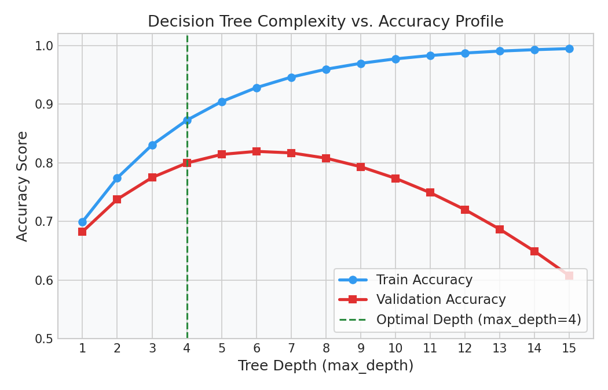

# Decision Trees: Boundary Rules & Complexity Sweeps

This guide details how Decision Trees recursively split feature space into rule-based boundaries, how to extract these split rules using Python, and how to sweep tree depth to identify overfitting.

---

## 1. Applied Decision Tree Boundaries

Decision trees partition the feature space using orthogonal cuts (parallel to the feature axes). The model learns sequential `IF-THEN` conditional boundaries that map inputs to classes.

Unlike linear classifiers that seek a single dividing slope, a decision tree can partition highly non-linear clusters by stacking cuts. However, without depth constraints, the model will create narrow, highly isolated boundary boxes to fit individual noisy outliers, leading to severe overfitting.

---

## 2. Python Implementation: Rule Extraction

In production, you can inspect the exact rules learned by your tree model using Scikit-Learn's `export_text` function. This is highly useful for validating that the model has not learned biased split rules.

### Python Code Pipeline
```python
import numpy as np
import pandas as pd
from sklearn.tree import DecisionTreeClassifier, export_text

# Generate e-commerce customer transaction session data
np.random.seed(42)
m = 100
page_views = np.random.randint(1, 15, m)
discount_applied = np.random.choice([0, 1], m, p=[0.7, 0.3])

# Target: purchased (1) or not (0)
# True pattern: purchased if page_views > 6 and discount_applied = 1
y = np.where((page_views > 6) & (discount_applied == 1), 1, 0)
# Add outlier noise (mislabeled purchase)
y[12] = 1 

df = pd.DataFrame({
    'page_views': page_views,
    'discount_applied': discount_applied,
    'purchased': y
})

X = df[['page_views', 'discount_applied']]
y = df['purchased']

# Fit a constrained Decision Tree Classifier
model = DecisionTreeClassifier(max_depth=3, min_samples_leaf=2, random_state=42)
model.fit(X, y)

# Export the learned rules as a text tree
tree_rules = export_text(model, feature_names=list(X.columns))
print(tree_rules)
```

### Expected Console Output
```text
|--- page_views <= 6.50
|   |--- class: 0
|--- page_views >  6.50
|   |--- discount_applied <= 0.50
|   |   |--- class: 0
|   |--- discount_applied >  0.50
|   |   |--- class: 1
```

---

## 3. Overfitting & Complexity Sweeps

To find the optimal balance between bias and variance, you can run a complexity sweep on `max_depth` to track training vs. validation accuracy.

- **Underfitting (High Bias):** A `max_depth` of 1 or 2 splits on too few features, failing to capture the interaction between `page_views` and `discount_applied`.
- **Overfitting (High Variance):** A `max_depth` of 10 or more isolates individual noisy samples (like User 12) into custom leaf nodes, collapsing training error to 0 but degrading generalization on unseen test data.

### Diagnostic Visual (Depth Complexity Sweep)


---

## 4. Interactive Practice Notebook
To run the depth sweep, plot the 2D decision boundary surfaces, and practice tuning decision tree parameters, open the interactive notebook:
- [01_decision_trees_complexity_and_rules.ipynb](file:///d:/Study/Prep/machine-learning-prep/supervised-learning/tree-based-models/01_decision_trees_complexity_and_rules.ipynb)
