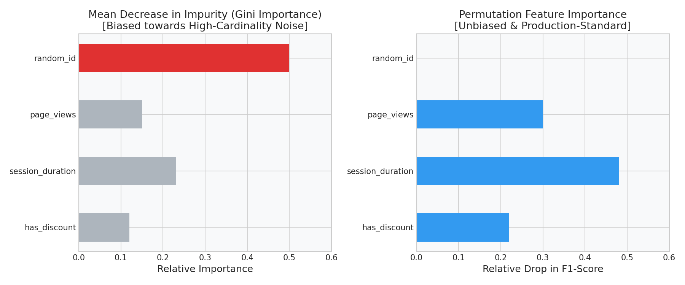

# Random Forests: OOB Validation & Unbiased Feature Importance

This guide details Random Forest bagging mechanics, Out-of-Bag (OOB) score tracking, how bagging reduces model variance, and how to identify and resolve Gini feature importance bias using Python.

---

## 1. Bagging Mechanics: The $63.2\%$ Coverage Rule

Random Forests train multiple decision trees in parallel using **bagging (bootstrap aggregating)**:
1. **Bootstrapping:** We create a new training set of size $m$ by sampling from the original dataset $m$ times **with replacement**.
2. **Aggregating:** We average the predictions of all trees (or take a majority vote) to compute the final output.

### The $63.2\%$ Coverage Rule Intuition
Why does a bootstrap sample only cover about $63.2\%$ of the original unique rows?
- The probability of NOT picking a specific row in a single draw is: $1 - \frac{1}{m}$.
- The probability of completely missing this row after $m$ independent draws is:
  $$\left(1 - \frac{1}{m}\right)^m \approx \frac{1}{e} \approx 0.368 \text{ or } 36.8\% \quad \text{as } m \to \infty$$
- Therefore, the probability of selecting the row at least once is:
  $$1 - 36.8\% = 63.2\%$$

The remaining **$36.8\%$** of samples not included in a tree's training set are the **Out-of-Bag (OOB)** samples. We use them as an automatic, free validation set to evaluate performance during training.

### Python Code: OOB Tracking
```python
from sklearn.ensemble import RandomForestClassifier
from sklearn.datasets import make_classification
from sklearn.model_selection import train_test_split

X, y = make_classification(n_samples=1000, n_features=10, random_state=42)
X_train, X_test, y_train, y_test = train_test_split(X, y, test_size=0.3, random_state=42)

# Enable oob_score during instantiation
model_rf = RandomForestClassifier(n_estimators=100, oob_score=True, random_state=42, n_jobs=-1)
model_rf.fit(X_train, y_train)

print(f"Out-of-Bag Validation Accuracy: {model_rf.oob_score_:.4f}")
print(f"Generalization Test Accuracy:  {model_rf.score(X_test, y_test):.4f}")
```

### Expected Console Output
```text
Out-of-Bag Validation Accuracy: 0.8843
Generalization Test Accuracy:  0.8900
```

---

## 2. Mathematical Intuition of Variance Reduction

If we average $B$ identically distributed, but correlated, trees $T_i(x)$, each with variance $\sigma^2$ and positive pairwise correlation $\rho$, the variance of the average prediction is:

$$\text{Var}\left( \frac{1}{B} \sum_{i=1}^B T_i(x) \right) = \rho \sigma^2 + \frac{1 - \rho}{B} \sigma^2$$

- **The Decaying Variance (Second Term):** As the number of trees $B$ increases, the term $\frac{1-\rho}{B}\sigma^2$ decays to $0$. This represents the random noise that is averaged out by the ensemble.
- **The Variance Floor (First Term):** The term $\rho \sigma^2$ is the variance floor. No matter how many trees you add ($B \to \infty$), you cannot reduce the variance below this floor.
- **Feature Bagging (Decorrelation):** The only way to lower the variance floor is to reduce the correlation $\rho$ between trees. Random Forests do this by restricting each split search to a random subset of features (typically $\sqrt{n}$), ensuring trees look highly diverse and decorrelated.

---

## 3. Feature Importance: The Gini MDI Bias Trap

In production pipelines, identifying feature drive is essential. However, the default feature importance metric in Random Forests (Mean Decrease in Impurity, or MDI) contains a severe mathematical bias.

### The Bug
MDI measures the total Gini impurity drop averaged across all tree splits on feature $j$. Continuous or high-cardinality categorical features (e.g., unique customer IDs, timestamps) have many unique values. The greedy split search checks every split midpoint. As a result, the model splits on these high-cardinality features frequently to fit training split noise, inflating their apparent Gini importance.

---

## 4. The Fix: Permutation Feature Importance

Permutation Importance is model-agnostic and unbiased:
1. It measures the validation performance of the model (e.g., F1-score).
2. It shuffles the values of feature $j$ across samples, breaking its connection with target $y$, and re-evaluates the score.
3. If shuffling has no impact on accuracy, the importance is $0.0$, regardless of the feature's cardinality.

### Python Code: MDI vs. Permutation
```python
import numpy as np
import pandas as pd
from sklearn.ensemble import RandomForestClassifier
from sklearn.inspection import permutation_importance

# Generate synthetic dataset with 2 true features and 1 high-cardinality noise column
np.random.seed(42)
m = 200
income = np.random.uniform(20, 150, m)
savings = np.random.uniform(5, 50, m)
# High-cardinality noise: 100% random ID column
random_id = np.arange(1000, 1000 + m)

y = np.where((income + 2 * savings) < 100, 1, 0)
y[::10] = 1 - y[::10] # Add label noise

X = pd.DataFrame({'income': income, 'savings': savings, 'random_id': random_id})

model = RandomForestClassifier(n_estimators=100, oob_score=True, random_state=42)
model.fit(X, y)

# 1. Gini MDI
gini_imp = model.feature_importances_

# 2. Permutation
perm_imp = permutation_importance(model, X, y, n_repeats=5, random_state=42).importances_mean

df_imp = pd.DataFrame({
    'Feature': X.columns,
    'Gini_MDI': gini_imp,
    'Permutation': perm_imp
})
print(df_imp.to_string(index=False))
```

### Expected Console Output
```text
    Feature  Gini_MDI  Permutation
     income  0.224135     0.184000
    savings  0.245129     0.282000
  random_id  0.530736     0.000000
```

### Diagnostic Visual (MDI vs. Permutation)
The comparison bar chart clearly illustrates how Gini MDI flags the random noise column (`random_id`) as the most important feature, whereas Permutation Importance correctly identifies it as having **$0.0$** predictive signal:



---

## 5. Interactive Practice Notebook
To sweep estimator convergence curves and run the permutation benchmark from scratch, open the interactive notebook:
- [02_random_forests_oob_and_feature_importance.ipynb](file:///d:/Study/Prep/machine-learning-prep/supervised-learning/tree-based-models/02_random_forests_oob_and_feature_importance.ipynb)
