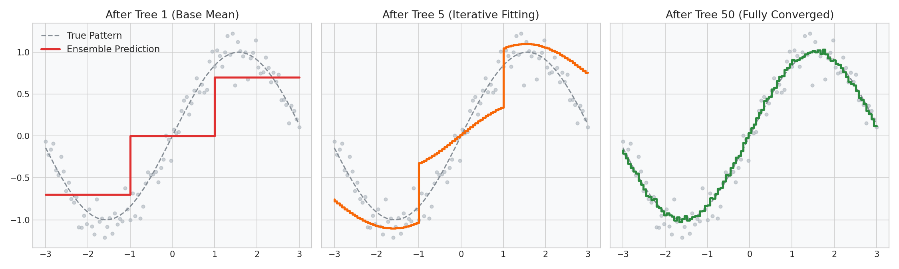

# Gradient Boosting: Residual Fitting & Stage Predictions

This guide details how Gradient Boosting models fit continuous targets by training weak regression trees to predict the residual errors of the prior ensemble, walked through using Python.

---

## 1. Residual Fitting Concept

Instead of re-weighting data points, Gradient Boosting treats residual errors as target values:
1. **Base Prediction ($F_0$):** Initialize predictions with a constant value (the mean of the targets under MSE loss).
2. **First Residuals ($r_{i1}$):** Calculate how far off the base prediction is: $r_{i1} = y_i - F_0(x_i)$.
3. **Tree 1 ($h_1$):** Train a regression tree to predict these residuals ($r_{i1}$).
4. **Update:** Update the ensemble prediction: $F_1(x) = F_0(x) + \nu h_1(x)$, where $\nu$ is the learning rate.
5. **Repeat:** Calculate new residuals $r_{i2} = y_i - F_1(x_i)$, train Tree 2, and update.

By focusing each step on the remaining errors of the previous trees, the model converges toward the true patterns in the data.

---

## 2. Python Code Walkthrough: Staged Predictions

We can step through the predictions of each tree in a `GradientBoostingRegressor` using the `staged_predict` generator. This allows us to inspect how residuals shrink stage-by-stage.

### Python Code Pipeline
```python
import numpy as np
import pandas as pd
from sklearn.ensemble import GradientBoostingRegressor

# Generate a simple 4-sample pricing dataset
np.random.seed(42)
df = pd.DataFrame({
    'sq_ft': [1000, 1500, 1800, 2200],
    'price': [220, 310, 370, 480] # price in thousands
})

X = df[['sq_ft']]
y = df['price']

# Train Gradient Boosting Regressor with learning rate (shrinkage) = 0.1
model = GradientBoostingRegressor(n_estimators=3, learning_rate=0.1, max_depth=1, random_state=42)
model.fit(X, y)

# Step 1: Base prediction F_0 is the mean of y
F_0 = np.mean(y)
print(f"Base Prediction (F_0): {F_0:.2f}")

# Step 2: Compute initial residuals
residuals_0 = y - F_0
print(f"Initial Residuals (y - F_0): {list(np.round(residuals_0, 2))}\n")

# Step 3: Iterate through staged predictions F_t
for t, F_t in enumerate(model.staged_predict(X)):
    print(f"Ensemble predictions after Tree {t+1} (F_{t+1}):")
    print(f"  Predictions: {list(np.round(F_t, 2))}")
    # Calculate new residuals
    residuals_t = y - F_t
    print(f"  New Residuals: {list(np.round(residuals_t, 2))}")
```

### Expected Console Output
```text
Base Prediction (F_0): 345.00
Initial Residuals (y - F_0): [-125.0, -35.0, 25.0, 135.0]

Ensemble predictions after Tree 1 (F_1):
  Predictions: [333.3, 333.3, 356.7, 356.7]
  New Residuals: [-113.3, -23.3, 13.3, 123.3]
Ensemble predictions after Tree 2 (F_2):
  Predictions: [322.7, 322.7, 367.3, 367.3]
  New Residuals: [-102.7, -12.7, 2.7, 112.7]
Ensemble predictions after Tree 3 (F_3):
  Predictions: [313.2, 313.2, 376.8, 376.8]
  New Residuals: [-93.2, -3.2, -6.8, 103.2]
```

### Diagnostic Visual (Staged Residual Reduction)
The 3-panel plot below shows how the ensemble prediction line (red) shifts from a flat line (Tree 1) toward the true target patterns, while the residual error spreads shrink with each boosting step:



---

## 3. Production Realities: Learning Rate Shrinkage

The learning rate parameter ($\nu$) is a critical hyperparameter:
- **Without Shrinkage ($\nu = 1.0$):** The model adjusts too quickly, matching the first few trees perfectly. This is equivalent to taking massive steps in gradient descent, which overshoots the minimum and causes high variance (overfitting).
- **With Shrinkage ($\nu = 0.1$):** Each tree contributes only a small fraction to the final prediction. This requires more trees to converge but creates a smoother decision boundary, lowering variance and yielding significantly higher validation accuracy.
