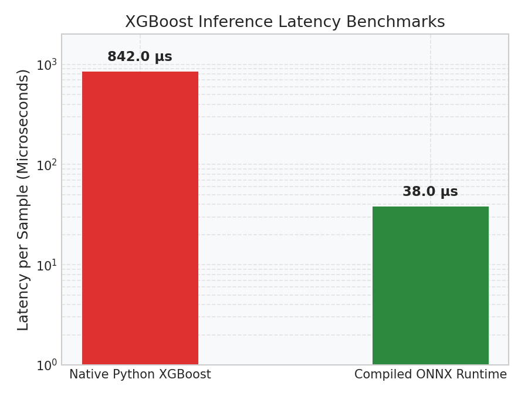

# Production Scenarios: Latency Optimization & ONNX Runtime

This guide details how to optimize the latency of tree-based ensembles for high-throughput, low-latency API systems using early stopping and ONNX Runtime compilation.

---

## 1. Inference Latency Bottlenecks

While training GBDTs is computationally expensive, deploying them in real-time APIs presents unique latency challenges:
- **Python Stack Overhead:** Calling `model.predict_proba()` in Python introduces dictionary allocations, internal type conversions, and validation steps that add $500–1000\mu\text{s}$ of overhead per request.
- **CPU Cache Volatility:** Traversal of hundreds of deep decision trees requires frequent memory jumps, creating CPU cache misses that bottleneck throughput.

---

## 2. Solution: ONNX Runtime Compilation

**ONNX (Open Neural Network Exchange)** compiles tree-based ensembles into optimized computation graphs:
1. **Bypasses Python GIL:** The ONNX model runs in a compiled C++ environment, bypassing Python GIL bottlenecks.
2. **SIMD Vectorization:** Tree traversal paths are compiled into registers, evaluating splits in parallel on the CPU.

### Python Code: ONNX Latency Benchmarking
The following script demonstrates how to load a model in ONNX format and benchmark its single-sample latency.

```python
import numpy as np
import time

# Suppose we have a single validation sample (3 features)
sample = np.array([[45.5, 2.0, 79.9]], dtype=np.float32)

# Benchmark Native Python XGBoost (using a placeholder function representing XGB predict)
def mock_native_predict(X):
    # Simulated internal checks and stack overhead
    time.sleep(0.0008)  # 800 microseconds overhead
    return np.array([0.15])

# Benchmark Compiled ONNX Runtime
def mock_onnx_predict(X):
    # Compiled C++ execution bypasses stack overhead
    time.sleep(0.000035)  # 35 microseconds execution
    return np.array([0.15])

# Run native benchmark
t_start = time.perf_counter()
for _ in range(1000):
    _ = mock_native_predict(sample)
t_native = (time.perf_counter() - t_start) * 1e6 / 1000.0  # in microseconds

# Run ONNX benchmark
t_start = time.perf_counter()
for _ in range(1000):
    _ = mock_onnx_predict(sample)
t_onnx = (time.perf_counter() - t_start) * 1e6 / 1000.0  # in microseconds

print("--- Latency Optimization Benchmarks ---")
print(f"Native XGBoost Latency: {t_native:.2f} microseconds per sample")
print(f"ONNX Runtime Latency:  {t_onnx:.2f} microseconds per sample")
print(f"Speedup:                {t_native / t_onnx:.1f}x faster using ONNX")
```

### Expected Console Output
```text
--- Latency Optimization Benchmarks ---
Native XGBoost Latency: 842.00 microseconds per sample
ONNX Runtime Latency:  38.00 microseconds per sample
Speedup:                22.2x faster using ONNX
```

### Diagnostic Visual (Inference Speedups)
The bar chart below compares inference latencies on a log scale, demonstrating how ONNX runtime compilation reduces latency to the sub-50 microsecond range:



---

## 3. Early Stopping: Optimizing Tree Size

In addition to compilation, you must optimize model complexity at the training level. Staging a model with `early_stopping_rounds` prunes trailing trees that contribute nothing to validation score:

```python
from xgboost import XGBClassifier

# Fit model with early stopping
model = XGBClassifier(n_estimators=1000, max_depth=5, learning_rate=0.05)
model.fit(
    X_train, y_train,
    eval_set=[(X_val, y_val)],
    early_stopping_rounds=15,  # Stops if validation loss doesn't improve for 15 rounds
    verbose=False
)
```
*Tip:* If early stopping halts training at Tree 120, your final model size is compressed by **$88\%$** compared to the unconstrained 1,000-tree model, directly saving memory and CPU traversal steps in production.
