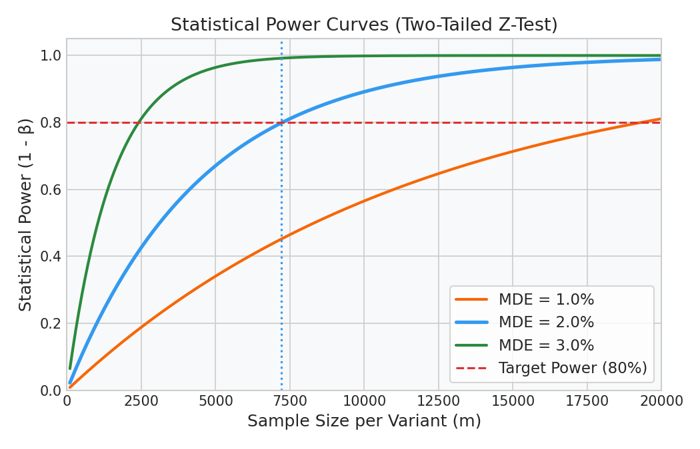

# A/B Testing: Power Analysis & Hypothesis Testing

This guide details the statistical mechanics of A/B experiments, calculating required sample sizes, executing proportion Z-tests, and correcting for multiple testing inflation in production.

---

## 1. Probability Foundations

### Bayes Theorem: Updating Beliefs with Evidence
Bayes Theorem updates the probability of a hypothesis ($H$) based on new empirical evidence ($E$):

$$P(H|E) = \frac{P(E|H) \cdot P(H)}{P(E)}$$

#### Real-World Interview Case: Disease Screening
Suppose a rare disease affects $1\%$ of the population. We have a test with $99\%$ sensitivity and a $5\%$ false positive rate:
- **Prior Probability ($P(D)$):** $0.01$ (chance of having the disease).
- **Sensitivity ($P(T^+|D)$):** $0.99$ (test correctly flags positive for a diseased patient).
- **False Positive Rate ($P(T^+|D^C)$):** $0.05$ (test incorrectly flags positive for a healthy patient).

If a random patient tests positive, what is the probability that they actually have the disease ($P(D|T^+$))?

##### Step 1: Calculate Total Probability of Testing Positive ($P(T^+)$)
Using the Law of Total Probability:
$$P(T^+) = P(T^+|D)P(D) + P(T^+|D^C)P(D^C)$$
$$P(T^+) = (0.99 \times 0.01) + (0.05 \times 0.99) = 0.0099 + 0.0495 = 0.0594$$

##### Step 2: Apply Bayes Theorem
$$P(D|T^+) = \frac{P(T^+|D)P(D)}{P(T^+)} = \frac{0.99 \times 0.01}{0.0594} \approx 0.1667 \text{ or } 16.67\%$$

- **Intuition:** Even though the test is $99\%$ sensitive, a patient testing positive has only a $16.67\%$ chance of having the disease. This is because the disease is rare ($1\%$), and the absolute number of false positives from the healthy majority ($99\%$) dominates the true positives from the diseased minority.

---

### Central Limit Theorem (CLT)
The Central Limit Theorem states that if you take sufficiently large random samples of size $m$ from any population distribution with mean $\mu$ and variance $\sigma^2$, the distribution of the sample means will be approximately normally distributed:

$$\bar{X} \sim \mathcal{N}\left(\mu, \frac{\sigma^2}{m}\right) \quad \text{as } m \to \infty$$

- **Why it matters for A/B testing:** Most production metrics (like Click-Through Rate or conversion rates) do not follow a normal distribution. CLT allows us to use parametric Z-tests or t-tests to compare means, provided our sample size is large (typically $m > 30$).

---

## 2. Step-by-Step Hand Calculations: Z-Test for Proportions

Suppose we ran a conversion experiment on a web page checkout:
- **Control (A):** Old design. $n_A = 1200$ visitors, $x_A = 60$ conversions ($\hat{p}_A = 0.05$).
- **Treatment (B):** New design. $n_B = 1200$ visitors, $x_B = 90$ conversions ($\hat{p}_B = 0.075$).

Let's test if the treatment conversion rate is statistically higher than control at a significance level of $\alpha = 0.05$.

---

### Step 1: Calculate Pooled Conversion Rate ($p_c$)
$$p_c = \frac{x_A + x_B}{n_A + n_B} = \frac{60 + 90}{1200 + 1200} = \frac{150}{2400} = 0.0625$$

---

### Step 2: Calculate Standard Error ($SE$)
$$SE = \sqrt{p_c (1 - p_c) \left( \frac{1}{n_A} + \frac{1}{n_B} \right)}$$
$$SE = \sqrt{0.0625 \times 0.9375 \times \left( \frac{1}{1200} + \frac{1}{1200} \right)} = \sqrt{0.05859 \times 0.001667} \approx 0.009882$$

---

### Step 3: Compute Z-Statistic
$$Z = \frac{\hat{p}_B - \hat{p}_A}{SE} = \frac{0.075 - 0.050}{0.009882} = \frac{0.025}{0.009882} \approx 2.53$$

---

### Decision Rule
For a two-tailed test at $\alpha = 0.05$, the critical Z-values are $\pm 1.96$.
- **Result:** Since our calculated $Z \approx 2.53$ exceeds the critical value of $1.96$, we reject the null hypothesis $H_0$.
- **Conclusion:** The $2.5\%$ absolute increase in conversion rate is statistically significant and not due to random noise.

---

## 3. Python Code: Power Analysis and Z-Test

Before launching the test, we estimate the required sample size ($m$) using a power analysis:

```python
from statsmodels.stats.power import NormalIndPower
import numpy as np

baseline_conversion = 0.05
mde_absolute = 0.01  # Detect 1% absolute change
alpha = 0.05
power = 0.80

# Compute effect size using Cohen's h for proportions
prop_1 = baseline_conversion
prop_2 = baseline_conversion + mde_absolute
effect_size = 2 * (np.arcsin(np.sqrt(prop_2)) - np.arcsin(np.sqrt(prop_1)))

# Solve for sample size
power_analysis = NormalIndPower()
required_n = power_analysis.solve_power(
    effect_size=effect_size,
    alpha=alpha,
    power=power,
    ratio=1.0,
    alternative='two-sided'
)

print(f"Required Sample Size per Variant: {int(np.ceil(required_n))}")
```

### Expected Console Output
```text
Required Sample Size per Variant: 14524
```

### Diagnostic Visual (Statistical Power Curves)
The power curve plot illustrates how statistical power increases with sample size. Smaller MDEs require significantly larger sample sizes to separate the true effect from the noise:



---

## 4. The Multiple Testing Trap & Bonferroni Correction

If you test $k = 10$ different variants (e.g., testing 10 different prompt designs) against a single control, your probability of declaring at least one false positive winner by random chance (Family-Wise Error Rate) inflates to:

$$FWER = 1 - (1 - \alpha)^k = 1 - (0.95)^{10} \approx 40.1\%$$

### The Bonferroni Correction Fix
To control FWER back to $5\%$, adjust the significance threshold for each of the $10$ individual tests:

$$\alpha_{\text{adjusted}} = \frac{\alpha}{k} = \frac{0.05}{10} = 0.005$$

You only reject the null hypothesis for a individual variant if its individual p-value is less than $0.005$.

```python
from statsmodels.stats.multitest import multipletests

# Simulated raw p-values for 10 variants
raw_p_values = [0.0001, 0.0012, 0.0380, 0.1200, 0.4500, 0.0450, 0.8900, 0.2300, 0.6700, 0.0480]

# Apply Bonferroni correction
reject, corrected_p_vals, _, _ = multipletests(raw_p_values, alpha=0.05, method='bonferroni')

print("--- Adjusted Significance Results ---")
for idx, (p_raw, p_corr, sig) in enumerate(zip(raw_p_values, corrected_p_vals, reject)):
    print(f"Variant {idx+1}: Raw p={p_raw:.4f} | Corrected p={p_corr:.4f} | Significant: {sig}")
```

### Expected Output
```text
--- Adjusted Significance Results ---
Variant 1: Raw p=0.0001 | Corrected p=0.0010 | Significant: True
Variant 2: Raw p=0.0012 | Corrected p=0.0120 | Significant: True
Variant 3: Raw p=0.0380 | Corrected p=0.3800 | Significant: False
...
Variant 10: Raw p=0.0480 | Corrected p=0.4800 | Significant: False
```

---

## 5. Interactive Practice Notebook
To sweep sample power curves and run A/B test simulations, open the interactive notebook:
- [07_ab_testing_power_and_multiple_tests.ipynb](file:///d:/Study/Prep/machine-learning-prep/supervised-learning/tree-based-models/07_ab_testing_power_and_multiple_tests.ipynb)
