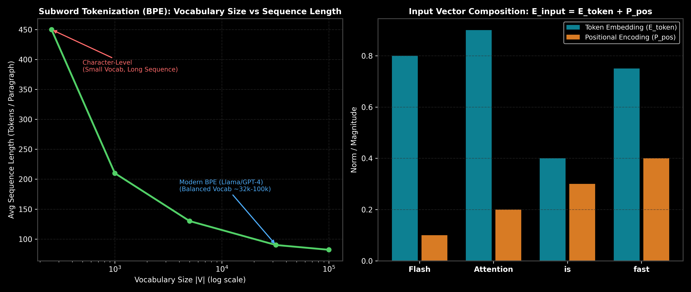

# Subword Tokenization & Embedding Mechanics

This guide details text tokenization paradigms (Character, Word, Subword BPE, WordPiece, SentencePiece, `tiktoken`) and vector embedding mechanics (Token, Positional, Contextual representations), complete with BPE step-by-step hand calculations, Python code, and production trade-offs.

> **Notebook Companion**: [01b_tokenization_and_embeddings.ipynb](file:///d:/Study/Prep/machine-learning-prep/transformers/01b_tokenization_and_embeddings.ipynb)

---

## 1. Tokenization Paradigms Comparison

Tokenization converts raw text strings into discrete numerical token IDs ($x \in \mathbb{N}$) suitable for input into embedding matrices.

```text
Tokenization Granularity  Vocabulary Size (|V|)    Average Sequence Length (N)  Primary Drawback
----------------------------------------------------------------------------------------------------------------------
Character-Level           Ultra-Small (~256)      Extremely Long (High O(N^2)) Destroys semantic chunk structure
Word-Level                Ultra-Large (>100,000)  Short                        Huge memory, Out-Of-Vocabulary (OOV)
Subword (BPE/WordPiece)   Balanced (~32,000)       Optimal                      Subword chunking on foreign/code characters
```



---

## 2. Subword Tokenization Algorithms

### A. Byte-Pair Encoding (BPE)
Used by GPT-2, GPT-4, Llama 3, RoBERTa.
1. Start with initial vocabulary of individual characters ($|V|_{\text{init}} = 256$).
2. Count frequency of all adjacent character pairs in the training corpus.
3. Merge the most frequent pair $(c_i, c_j) \rightarrow c_{ij}$ into a new vocabulary token.
4. Repeat merging iteratively until target vocabulary size $|V|$ is reached.

### B. WordPiece
Used by BERT, DistilBERT.
- Similar to BPE, but chooses which pair to merge by maximizing the likelihood of the language model under a unigram model:
  $$\text{Score}(u, v) = \frac{\text{count}(uv)}{\text{count}(u) \times \text{count}(v)}$$

### C. SentencePiece & Byte-Fallback
Used by Llama, T5, Mistral.
- Treats input text as a raw byte stream (no pre-tokenization space splitting), replacing spaces with a meta-symbol (`_`).
- **Byte-Fallback**: Any unknown character is represented directly by its 1-byte raw UTF-8 value ($0 - 255$), resulting in **zero Out-Of-Vocabulary (OOV) tokens**.

---

## 3. Mathematical Precision & Hand Calculation: BPE Merge Step (Andrew Ng Style)

Let's compute the first 2 BPE merge operations on a tiny sample corpus:

```text
Corpus Word      Frequency
--------------------------
"low"            5
"lower"          2
"newest"         6
"widest"         3
```

Initial character vocabulary representation:
- `l o w </w>`: 5
- `l o w e r </w>`: 2
- `n e w e s t </w>`: 6
- `w i d e s t </w>`: 3

### Step 1: Count Adjacent Character Pair Frequencies
- `(e, s)`: Appears in `newest` (6) + `widest` (3) = **9**
- `(s, t)`: Appears in `newest` (6) + `widest` (3) = **9**
- `(l, o)`: Appears in `low` (5) + `lower` (2) = **7**
- `(o, w)`: Appears in `low` (5) + `lower` (2) = **7**
- `(e, r)`: Appears in `lower` (2) = **2**

### Step 2: Execute Merge Operation #1 (`(e, s)` $\rightarrow$ `es`)
New Vocabulary State:
- `l o w </w>`: 5
- `l o w e r </w>`: 2
- `n e w es t </w>`: 6
- `w i d es t </w>`: 3

### Step 3: Execute Merge Operation #2 (`(es, t)` $\rightarrow$ `est`)
New Vocabulary State:
- `l o w </w>`: 5
- `l o w e r </w>`: 2
- `n e w est </w>`: 6
- `w i d est </w>`: 3

---

## 4. Input Embedding Matrix Lookup Algebra

The input vector $E_{\text{input}} \in \mathbb{R}^{N \times d}$ to the first Transformer layer is the element-wise sum of the Token Embedding matrix and Positional Encoding matrix:

$$E_{\text{input}}[i] = W_{\text{token}}[x_i] + P_{\text{pos}}[i]$$

Where:
- $W_{\text{token}} \in \mathbb{R}^{|V| \times d}$ is the learned token embedding lookup table.
- $x_i \in \{1, \dots, |V|\}$ is the integer token ID at sequence position $i$.
- $P_{\text{pos}} \in \mathbb{R}^{N \times d}$ is the positional encoding tensor.

```python
import torch
import torch.nn as nn

vocab_size = 32000
d_model = 4096

token_embedding = nn.Embedding(vocab_size, d_model)
input_ids = torch.tensor([101, 2054, 2003, 102]) # Token IDs

embedded_vectors = token_embedding(input_ids)
print("Output Embedded Tensor Shape:", embedded_vectors.shape)
```

---

## 5. Production Failure Modes & Trade-offs

- **Tokenization Overhead on Code & Numbers**: BPE tokenizers trained primarily on English prose split numbers (e.g. `12345678` $\rightarrow$ `['12', '34', '56', '78']`) or code indentation into multiple tokens, inflating sequence length and execution cost.
- **Multilingual Tokenizer Bias**: English text averages $\sim 1.3$ tokens per word, whereas non-Latin scripts (e.g., Hindi, Arabic, Japanese) average $\sim 3.0 - 5.0$ tokens per word, making LLM inference $3\text{x} - 4\text{x}$ more expensive for non-English users.
