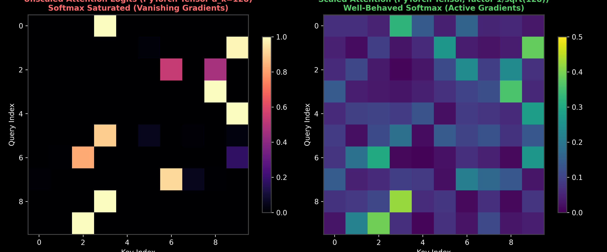

# Transformers: The Scaled Dot-Product Attention Mechanism

This guide details the mathematical foundations of the core Attention Mechanism, including the Query-Key-Value (QKV) database analogy, the variance proof for the scaling factor $\sqrt{d_k}$, a step-by-step numerical hand-calculation, and its production selection rules.

> **Notebook Companion**: [02_attention_mechanism.ipynb](file:///d:/Study/Prep/machine-learning-prep/transformers/02_attention_mechanism.ipynb)

---

## 1. What is Attention? The Database Analogy

Attention allows a model to dynamically focus on relevant parts of an input sequence. The mechanism is modeled after a database retrieval system:

```text
Component Name      Concept                     Production Analogy
----------------------------------------------------------------------------------------------------------------------
Query (Q)           The target search term      What you type in a search engine (e.g., "AI models").
Key (K)             The metadata attributes     The titles, tags, and category labels of database entries.
Value (V)           The actual item contents    The articles, pages, or video files mapped to those titles.
```

The attention scores determine how well the search query ($Q$) matches the metadata keys ($K$). We use these scores to compute a weighted sum of the values ($V$), extracting the most relevant content.

---

## 2. Mathematical Formulation: Scaled Dot-Product Attention

The standard equation for Scaled Dot-Product Attention is:
$$\text{Attention}(Q, K, V) = \text{softmax}\left( \frac{Q K^T}{\sqrt{d_k}} \right) V$$

Where:
- $Q \in \mathbb{R}^{N \times d_k}$ (matrix of queries for $N$ sequence steps).
- $K \in \mathbb{R}^{M \times d_k}$ (matrix of keys for $M$ sequence steps).
- $V \in \mathbb{R}^{M \times d_v}$ (matrix of values).
- $d_k$ is the dimensionality of the key vectors.

---

## 3. Mathematical Proof: Why Divide by $\sqrt{d_k}$?

In standard dot-product attention (without the scale factor), the scores are $S = Q K^T$. For large head dimensions $d_k$, the scale of the dot products grows, pushing the softmax function into its flat, saturated region.

### The Variance Scaling Proof:
Let $q \in \mathbb{R}^{d_k}$ and $k \in \mathbb{R}^{d_k}$ be independent random vectors representing a single query and key. Assume their elements are independent random variables with:
$$E[q_i] = 0, \quad \text{Var}(q_i) = 1$$
$$E[k_i] = 0, \quad \text{Var}(k_i) = 1$$

The dot product is the sum of element-wise products:
$$q \cdot k = \sum_{i=1}^{d_k} q_i k_i$$

1. **Calculate the Mean of $q_i k_i$:**
   Since $q_i$ and $k_i$ are independent:
   $$E[q_i k_i] = E[q_i] E[k_i] = 0 \times 0 = 0$$
2. **Calculate the Variance of $q_i k_i$:**
   $$\text{Var}(q_i k_i) = E[q_i^2 k_i^2] - (E[q_i k_i])^2 = E[q_i^2] E[k_i^2] - 0$$
   Since $E[X^2] = \text{Var}(X) + (E[X])^2$:
   $$E[q_i^2] = 1 + 0 = 1, \quad E[k_i^2] = 1 + 0 = 1 \implies \text{Var}(q_i k_i) = 1 \times 1 = 1$$
3. **Calculate the Variance of the Sum ($q \cdot k$):**
   Since the dimensions are independent, the variance of the sum is the sum of the variances:
   $$\text{Var}(q \cdot k) = \sum_{i=1}^{d_k} \text{Var}(q_i k_i) = \sum_{i=1}^{d_k} 1 = d_k$$

### The Softmax Vanishing Gradient Trap
- **The Issue:** The variance of the raw dot product $q \cdot k$ scales linearly with key dimension $d_k$. If $d_k = 128$, the variance is $128$, meaning dot product values frequently exceed $\pm 15$. 
  Taking the softmax of such large numbers forces the output distribution to extreme probabilities (e.g. $[0.0, \ 1.0, \ 0.0]$). The derivative of softmax $\sigma'(z)$ drops close to $0.0$, vanishing gradients and halting model updates.
- **The Solution:** By dividing by $\sqrt{d_k}$, we scale the variance of the dot product back to $1.0$:
  $$\text{Var}\left( \frac{q \cdot k}{\sqrt{d_k}} \right) = \frac{1}{d_k} \text{Var}(q \cdot k) = \frac{d_k}{d_k} = \mathbf{1.0}$$
  This keeps the inputs to the softmax layer within its active, high-gradient region $[-2.0, 2.0]$.



> [!NOTE]
> **Plot Interpretation & Interview Takeaways:**
> - **What is shown:** The left heatmap displays PyTorch tensor unscaled dot-product attention logits ($\text{softmax}(QK^T)$ with $d_k=128$), where scores overflow into extreme probabilities ($1.0$ vs $0.0$, shown in bright yellow/dark black). The right heatmap displays Scaled Dot-Product Attention ($\text{softmax}(QK^T / \sqrt{d_k})$), preserving a smooth, balanced probability distribution.
> - **Key Mathematical Insight:** For independent standard normal vectors $q_i, k_i \sim \mathcal{N}(0, 1)$, $\text{Var}(q \cdot k) = d_k$. As $d_k$ grows large, raw dot products reach large values, saturating softmax where its derivative $\sigma'(z) \approx 0.0$. Scaling by $\frac{1}{\sqrt{d_k}}$ forces $\text{Var}\left(\frac{q \cdot k}{\sqrt{d_k}}\right) = 1.0$, keeping softmax in its active, high-gradient regime.
> - **Interview Application:** When asked *"Why do we divide by $\sqrt{d_k}$ in Scaled Dot-Product Attention?"*, state the variance proof, explain how unscaled dot products cause softmax saturation, and reference this gradient magnitude stabilization.

---

## 4. Step-by-Step Hand Calculations: Attention Pass (Andrew Ng Style)

Let's compute the attention pass for a single query token vector and two database key-value pairs:
- **Query vector:** $q = \begin{bmatrix} 1.0 & 2.0 \end{bmatrix}$ (dimension $d_k = 2$)
- **Keys matrix:** $K = \begin{bmatrix} 1.0 & 0.0 \\ 0.0 & 1.0 \end{bmatrix}$ (Row 1 is Key 1 ($k_1$), Row 2 is Key 2 ($k_2$))
- **Values matrix:** $V = \begin{bmatrix} 10.0 \\ 20.0 \end{bmatrix}$ (Row 1 is Value 1 ($v_1$), Row 2 is Value 2 ($v_2$))

---

### Step 1: Compute Raw Dot Products
$$q K^T = \begin{bmatrix} 1.0 & 2.0 \end{bmatrix} \begin{bmatrix} 1.0 & 0.0 \\ 0.0 & 1.0 \end{bmatrix} = \begin{bmatrix} (1 \times 1 + 2 \times 0) & (1 \times 0 + 2 \times 1) \end{bmatrix} = \begin{bmatrix} 1.0 & 2.0 \end{bmatrix}$$

---

### Step 2: Apply Variance Scaling ($\sqrt{d_k} = \sqrt{2} \approx 1.4142$)
Divide the raw scores by the scale factor:
$$\text{Scaled Scores} = \frac{\begin{bmatrix} 1.0 & 2.0 \end{bmatrix}}{1.4142} \approx \begin{bmatrix} 0.7071 & 1.4142 \end{bmatrix}$$

---

### Step 3: Compute Softmax Probability Distribution
1. **Exponential scaling:**
   $$e^{0.7071} \approx 2.0281, \quad e^{1.4142} \approx 4.1132$$
2. **Sum of Exponents:**
   $$\text{Sum} = 2.0281 + 4.1132 = 6.1413$$
3. **Probability Normalization:**
   $$a_1 = \frac{2.0281}{6.1413} \approx \mathbf{0.3302}, \quad a_2 = \frac{4.1132}{6.1413} \approx \mathbf{0.6698}$$

$$\text{Attention weights } A = \begin{bmatrix} 0.3302 & 0.6698 \end{bmatrix}$$

---

### Step 4: Aggregate Values
Compute the weighted sum of values using our attention weights:
$$\text{Output} = A V = \begin{bmatrix} 0.3302 & 0.6698 \end{bmatrix} \begin{bmatrix} 10.0 \\ 20.0 \end{bmatrix} = (0.3302 \times 10.0) + (0.6698 \times 20.0) = 3.302 + 13.396 = \mathbf{16.698}$$

**Result:** The attention output vector is **$16.698$**.

---

## 5. Production Selection Rules

- **Additive Attention vs. Scaled Dot-Product Attention:**
  - *Additive (Bahdanau):* Computes scores using a single hidden-layer MLP. Highly flexible, but cannot be vectorized.
  - *Scaled Dot-Product (Luong):* Computes scores using matrix multiplications ($QK^T$). **Highly preferred in production** because it is mathematically simpler and leverages optimized BLAS matrix routines on GPU hardware.

---

## 6. Raw NumPy Implementation
This code implements the scaled dot-product attention calculation in raw, vectorized NumPy:

```python
import numpy as np

def scaled_dot_product_attention(q, k, v, mask=None):
    """
    Computes Scaled Dot-Product Attention.
    Shapes:
        q: (..., seq_len_q, d_k)
        k: (..., seq_len_k, d_k)
        v: (..., seq_len_k, d_v)
    """
    d_k = q.shape[-1]
    
    # 1. Compute dot product scores
    matmul_qk = np.matmul(q, k.swapaxes(-2, -1))  # Shape: (..., seq_len_q, seq_len_k)
    
    # 2. Scale scores by sqrt(d_k)
    scaled_attention_logits = matmul_qk / np.sqrt(d_k)
    
    # 3. Apply mask (if causal or padding masking is active)
    if mask is not None:
        scaled_attention_logits += (mask * -1e9)
        
    # 4. Softmax probability distribution
    # Subtract max for numeric stability to prevent overflow
    shifted_logits = scaled_attention_logits - np.max(scaled_attention_logits, axis=-1, keepdims=True)
    exp_logits = np.exp(shifted_logits)
    attention_weights = exp_logits / np.sum(exp_logits, axis=-1, keepdims=True)
    
    # 5. Weight values
    output = np.matmul(attention_weights, v)  # Shape: (..., seq_len_q, d_v)
    
    return output, attention_weights

# Verification
Q = np.array([[1.0, 2.0]])
K = np.array([[1.0, 0.0], [0.0, 1.0]])
V = np.array([[10.0], [20.0]])

out, weights = scaled_dot_product_attention(Q, K, V)
print("Attention Weights:", weights)
print("Output Vector:", out)
```
