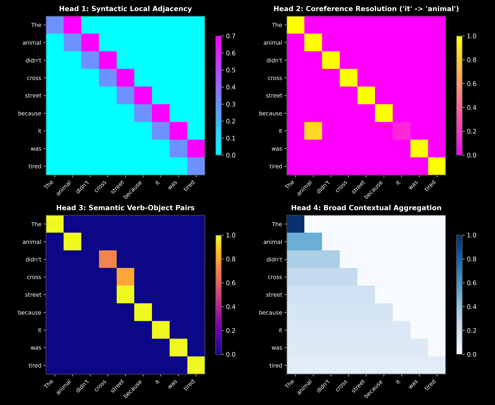

# Transformers: Multi-Head, Multi-Query & Grouped-Query Attention

This guide details the architectural variations of Multi-Head Attention (MHA), Multi-Query Attention (MQA), and Grouped-Query Attention (GQA), explaining the KV cache memory bandwidth bottlenecks they solve, with step-by-step tensor dimension splits and PyTorch implementation.

---

## 1. Why Multi-Head Attention (MHA)?

A single attention head computes a single softmax weight distribution. This forces the model to average its focus, which is a compromise.
- **The Solution:** Multi-Head Attention projects $Q$, $K$, and $V$ into $h$ independent, lower-dimensional subspaces. This allows different heads to jointly attend to different types of information at different positions.
  - *Head 1:* Focuses on grammatical syntax (e.g. matching subject nouns to verbs).
  - *Head 2:* Focuses on semantic facts (e.g. matching entity names to dates).
  - *Head 3:* Focuses on coreference resolution (e.g. matching pronouns like *"he"* to names).



---

## 2. Mathematical Formulations

Let $h$ be the number of attention heads, and $d_{\text{model}}$ be the model embedding dimension. Each head projects inputs to a lower dimension $d_k = d_v = d_{\text{model}} / h$.

### A. Multi-Head Attention (MHA)
For each head $i \in [1, h]$:
$$\text{head}_i = \text{Attention}\left( Q W_Q^{(i)}, \ K W_K^{(i)}, \ V W_V^{(i)} \right)$$
$$\text{MHA}(Q, K, V) = \text{Concat}(\text{head}_1, \dots, \text{head}_h) W^O$$
Where:
- $W_Q^{(i)}, W_K^{(i)} \in \mathbb{R}^{d_{\text{model}} \times d_k}$ are the head projection weight matrices.
- $W^O \in \mathbb{R}^{d_{\text{model}} \times d_{\text{model}}}$ is the final output projection matrix.
- **The KV Cache Bottleneck:** During autoregressive text decoding, we store the computed Keys ($K$) and Values ($V$) of all prior tokens in VRAM (the **KV Cache**) to avoid re-generating them at each step. Under MHA, storing $h$ independent Key and Value heads for large batches consumes massive memory bandwidth, stalling GPU throughput.

---

### B. Multi-Query Attention (MQA)
To reduce KV Cache memory size, MQA uses multiple Query heads but only a **single Key and Value head** shared across all query heads:
- **Queries:** Projected into $h$ heads ($Q_i = X W_Q^{(i)}$).
- **Keys & Values:** Projected into a single shared head ($K = X W_K$, $V = X W_V$).
- **Impact:** Reduces the VRAM KV cache size by a factor of $h$. However, it slightly degrades model capacity and accuracy.

---

### C. Grouped-Query Attention (GQA)
A middle ground that groups the $h$ query heads into $g$ groups. Each group shares a **single Key-Value head**:
- If $h = 8$ and $g = 2$, each KV head is shared by $8/2 = 4$ query heads.
- **Impact:** GQA (used by modern models like Llama-3) recovers almost all of MHA’s accuracy while maintaining the speed and memory savings of MQA.

```text
Attention Type   Query Heads   Key-Value Heads   KV Cache Memory Scale   General Performance
----------------------------------------------------------------------------------------------------------------------
MHA              h             h                 1.0 (Full Size)         Baseline Best
MQA              h             1                 1 / h                   Slightly degraded accuracy
GQA              h             g (where g < h)   g / h                   Identical to MHA
```

---

## 3. Step-by-Step Hand Calculations: Head Partitioning (Andrew Ng Style)

Let's trace how a single token vector is projected and partitioned under **MHA** vs. **MQA** vs. **GQA**:
- **Input vector (1 token):** $x = \begin{bmatrix} 1.0 & 2.0 & 3.0 & 4.0 \end{bmatrix}$ (dimension $d_{\text{model}} = 4$)
- **Configuration:** $h = 2$ heads (subspace dimension $d_k = 4/2 = 2$)
- Assume the projection weight matrices are identity slices ($W = I$):

### 1. Multi-Head Attention (MHA)
We project $x$ into 2 Query heads, 2 Key heads, and 2 Value heads:
- **Queries:**
  - Head 1 Query ($q^{(1)}$): $\begin{bmatrix} 1.0 & 2.0 \end{bmatrix}$
  - Head 2 Query ($q^{(2)}$): $\begin{bmatrix} 3.0 & 4.0 \end{bmatrix}$
- **Keys (Stored in KV Cache):**
  - Head 1 Key ($k^{(1)}$): $\begin{bmatrix} 1.0 & 2.0 \end{bmatrix}$
  - Head 2 Key ($k^{(2)}$): $\begin{bmatrix} 3.0 & 4.0 \end{bmatrix}$
- *KV Cache Storage Requirement:* **4 values** per token.

### 2. Multi-Query Attention (MQA)
We project $x$ into 2 Query heads, but only **1 Key head** and **1 Value head**:
- **Queries:**
  - Head 1 Query ($q^{(1)}$): $\begin{bmatrix} 1.0 & 2.0 \end{bmatrix}$
  - Head 2 Query ($q^{(2)}$): $\begin{bmatrix} 3.0 & 4.0 \end{bmatrix}$
- **Keys (Stored in KV Cache):**
  - Shared Key ($k$): $\begin{bmatrix} 1.0 & 2.0 \end{bmatrix}$
- *KV Cache Storage Requirement:* **2 values** per token (a **$50\%$ reduction**).

---

## 4. Production Scenario & Example

### Scenario: Scaling Concurrency on a vLLM LLM API Gateway
You deploy a 70B parameter Llama model on an NVIDIA A100 GPU node to serve real-time chatbot requests.
- **The Failure Mode:** When 10 users prompt the bot simultaneously, the system runs out of memory (`CUDA OOM`) or throughput slows down significantly. Profiling shows that the GPU cores are running at only $15\%$ compute capacity because the memory bandwidth of the GPU is saturated loading the massive MHA KV caches from VRAM to SRAM at each decoding step.
- **The Solution:** You switch to a model architecture configured with **Grouped-Query Attention (GQA)**. By grouping query heads ($h=32$ query heads, $g=8$ KV heads), GQA reduces the size of the KV cache by $4\text{x}$. This allows you to increase the serving concurrency from 10 to 40 users on the same GPU node, boosting generation throughput without degrading accuracy.

---

## 5. PyTorch MHA vs. GQA Head Splits

This code demonstrates how queries and keys are projected and reshaped under MHA vs. GQA:

```python
import torch
import torch.nn as nn
import math

class GroupedQueryAttention(nn.Module):
    def __init__(self, d_model, n_heads, n_kv_heads):
        super().__init__()
        self.n_heads = n_heads
        self.n_kv_heads = n_kv_heads
        self.d_k = d_model // n_heads
        self.num_queries_per_kv = n_heads // n_kv_heads
        
        # Linear projections
        self.q_proj = nn.Linear(d_model, d_model, bias=False)
        self.k_proj = nn.Linear(d_model, n_kv_heads * self.d_k, bias=False)
        self.v_proj = nn.Linear(d_model, n_kv_heads * self.d_k, bias=False)
        self.out_proj = nn.Linear(d_model, d_model, bias=False)
        
    def forward(self, x):
        batch_size, seq_len, _ = x.shape
        
        # 1. Project inputs
        q = self.q_proj(x)  # (B, T, d_model)
        k = self.k_proj(x)  # (B, T, n_kv_heads * d_k)
        v = self.v_proj(x)  # (B, T, n_kv_heads * d_k)
        
        # 2. Reshape for multi-head attention calculations
        # Shape: (B, n_heads, T, d_k)
        q = q.view(batch_size, seq_len, self.n_heads, self.d_k).transpose(1, 2)
        # Shape: (B, n_kv_heads, T, d_k)
        k = k.view(batch_size, seq_len, self.n_kv_heads, self.d_k).transpose(1, 2)
        v = v.view(batch_size, seq_len, self.n_kv_heads, self.d_k).transpose(1, 2)
        
        # 3. Expand Keys and Values to match Query head count
        # Repeat KV heads along the head dimension to match n_heads
        # Output Shape: (B, n_heads, T, d_k)
        k = k.repeat_interleave(self.num_queries_per_kv, dim=1)
        v = v.repeat_interleave(self.num_queries_per_kv, dim=1)
        
        # 4. Compute Scaled Dot-Product Attention
        scores = torch.matmul(q, k.transpose(-2, -1)) / math.sqrt(self.d_k)
        attention_weights = torch.softmax(scores, dim=-1)
        context = torch.matmul(attention_weights, v)  # (B, n_heads, T, d_k)
        
        # 5. Concatenate heads and project output
        context = context.transpose(1, 2).contiguous().view(batch_size, seq_len, -1)
        return self.out_proj(context)

# Verify shapes
x = torch.randn(2, 10, 256)  # Batch=2, Seq=10, d_model=256
gqa = GroupedQueryAttention(d_model=256, n_heads=8, n_kv_heads=2)
out = gqa(x)
print("GQA Output Tensor Shape:", out.shape)  # Expected: (2, 10, 256)
```
