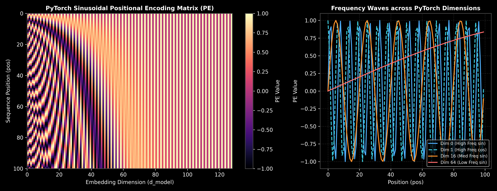
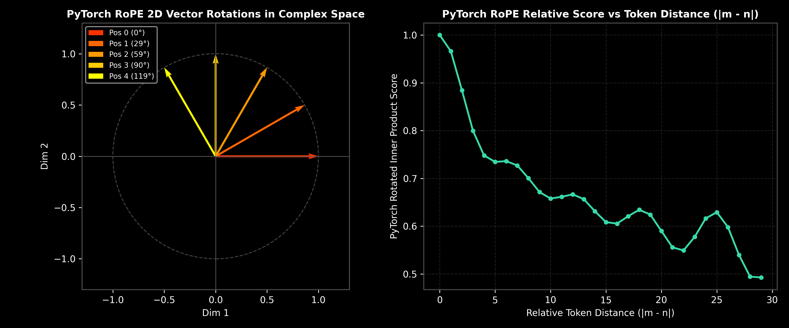
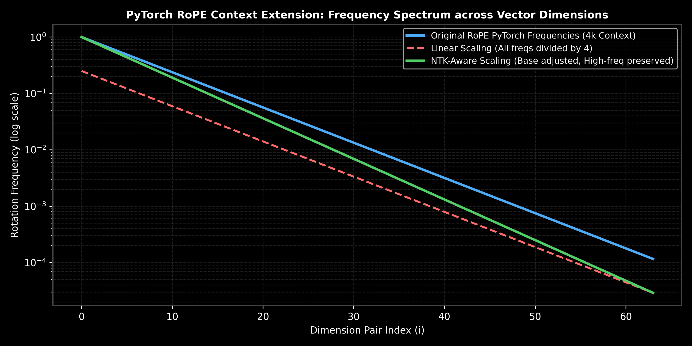

# Transformers: Positional Encoding & Context Extensions

This guide details the mathematical equations, relative properties, and implementations of Sinusoidal, Learned, and Rotary Positional Embeddings (RoPE), walking through hand-calculations and PyTorch implementation.

> **Notebook Companion**: [05_positional_encoding.ipynb](file:///d:/Study/Prep/machine-learning-prep/transformers/05_positional_encoding.ipynb)

---

## 1. Why is Positional Information Needed?

The self-attention calculation ($\text{softmax}(QK^T)V$) is **permutation invariant**.
- **The Issue:** If we shuffle the order of input tokens, the output vectors will be identical (only shuffled to match). The model has no concept of word order. For example, the model would treat the sentences *"The dog bit the man"* and *"The man bit the dog"* identically.
- **The Solution:** We inject positional information into the input representations, allowing the attention matrices to incorporate absolute or relative token order.

---

## 2. Mathematical Formulations

### A. Sinusoidal Positional Encoding (Original Transformer)
A fixed, non-learnable vector added directly to the input token embeddings:
$$PE_{(pos, 2i)} = \sin\left(\frac{pos}{10000^{\frac{2i}{d_{\text{model}}}}}\right)$$
$$PE_{(pos, 2i+1)} = \cos\left(\frac{pos}{10000^{\frac{2i}{d_{\text{model}}}}}\right)$$
Where:
- $pos$ is the token position index in the sequence.
- $i$ is the dimension index.
- **Relative Position Property:** For any fixed offset $k$, $PE_{pos+k}$ can be projected as a linear function of $PE_{pos}$. This allows the model to learn relative relationships.



> [!NOTE]
> **Plot Interpretation & Interview Takeaways (Sinusoidal Positional Encoding):**
> - **What is shown:** A 2D heatmap of Sinusoidal PE across 100 sequence positions ($y$-axis) and 128 embedding dimensions ($x$-axis), with 1D wave profiles on the right.
> - **Key Mathematical Insight:** Lower dimensions ($i \to 0$) oscillate rapidly with short wavelengths ($\lambda = 2\pi$), capturing fine-grained local offsets. Higher dimensions ($i \to d/2$) oscillate slowly with long wavelengths ($\lambda = 2\pi \cdot 10000$), capturing long-range positional trends.
> - **Interview Application:** Explains why Sinusoidal PE allows linear relative projections: for any fixed offset $k$, $PE_{pos+k}$ can be computed as a linear transformation of $PE_{pos}$.

---

### B. Learned Positional Embeddings
Treats position indices as discrete tokens, training an embedding matrix $PE \in \mathbb{R}^{N_{\text{max}} \times d_{\text{model}}}$.
- **Production Drawback:** The model cannot extrapolate to sequences longer than the maximum training context length $N_{\text{max}}$. If a model is trained on context length 2048, it will crash or fail at step 2049.

---

### C. Rotary Positional Embeddings (RoPE)
Instead of adding position vectors to input embeddings, RoPE multiplies the projected Query and Key vectors by a rotation matrix, rotating 2D slices of the vectors by an angle proportional to the token position $m$:
$$R_{\Theta, m}^2 \cdot x = \begin{bmatrix} \cos(m\theta) & -\sin(m\theta) \\ \sin(m\theta) & \cos(m\theta) \end{bmatrix} \begin{bmatrix} x_1 \\ x_2 \end{bmatrix}$$
Where $\theta_i = 10000^{-2(i-1)/d}$.

#### The Relative Advantage:
The dot product of a Query at position $m$ and a Key at position $n$ rotated via RoPE becomes:
$$\langle R_{\Theta, m} q, \ R_{\Theta, n} k \rangle = q^T R_{\Theta, n-m} k$$
- **Production Utility:** The attention weights depend *only* on the relative distance $n-m$, allowing the model to naturally model relative positions. Standard in modern LLMs (Llama, Mistral, Gemma).



> [!NOTE]
> **Plot Interpretation & Interview Takeaways (RoPE 2D Vector Rotations & Relative Decay):**
> - **What is shown:** Left: PyTorch 2D Query vector rotations in complex space across token positions. Right: The PyTorch inner product score $\langle R_m q, R_n k \rangle$ decaying smoothly as the relative token distance $|m-n|$ increases.
> - **Key Mathematical Insight:** RoPE rotates 2D slices of Query/Key vectors by angle $\phi = m\theta_i$. The dot product $\langle R_m q, R_n k \rangle = q^T R_{n-m} k$ depends exclusively on relative distance $n-m$, naturally introducing distance-decay without requiring absolute position embeddings.
> - **Interview Application:** Explains why modern LLMs (Llama-3, Mistral) prefer RoPE over learned absolute embeddings for sequence extrapolation and relative context modeling.

---

## 3. Step-by-Step Hand Calculations (Andrew Ng Style)

### A. Sinusoidal Position PE Calculation
Let's compute the positional encoding vector for a token at position $pos=1$ with a model dimension $d_{\text{model}} = 4$:
- **For dimension index $i=0$ (indexes $2i=0$, $2i+1=1$):**
  - $\text{Denominator} = 10000^{0/4} = 1.0$
  - $PE_{(1, 0)} = \sin(1 / 1.0) = \sin(1.0) \approx \mathbf{0.8415}$
  - $PE_{(1, 1)} = \cos(1 / 1.0) = \cos(1.0) \approx \mathbf{0.5403}$
- **For dimension index $i=1$ (indexes $2i=2$, $2i+1=3$):**
  - $\text{Denominator} = 10000^{2/4} = 100.0$
  - $PE_{(1, 2)} = \sin(1 / 100.0) = \sin(0.01) \approx \mathbf{0.0100}$
  - $PE_{(1, 3)} = \cos(1 / 100.0) = \cos(0.01) \approx \mathbf{0.9999}$

$$PE_1 = \begin{bmatrix} 0.8415 & 0.5403 & 0.0100 & 0.9999 \end{bmatrix}$$

---

### B. RoPE Rotation Calculation
Rotate a 2D query vector $q = \begin{bmatrix} 1.0 \\ 1.0 \end{bmatrix}$ at position $m=2$ with base angle $\theta = \frac{\pi}{4}$ ($45^\circ$):
1. **Compute Rotation Angle:**
   $$\phi = m\theta = 2 \times \frac{\pi}{4} = \frac{\pi}{2} \ (90^\circ)$$
2. **Setup Rotation Matrix ($R$):**
   $$R = \begin{bmatrix} \cos(\pi/2) & -\sin(\pi/2) \\ \sin(\pi/2) & \cos(\pi/2) \end{bmatrix} = \begin{bmatrix} 0.0 & -1.0 \\ 1.0 & 0.0 \end{bmatrix}$$
3. **Compute Rotated Vector:**
   $$q_{\text{rot}} = R q = \begin{bmatrix} 0.0 & -1.0 \\ 1.0 & 0.0 \end{bmatrix} \begin{bmatrix} 1.0 \\ 1.0 \end{bmatrix} = \begin{bmatrix} (0 \times 1 - 1 \times 1) \\ (1 \times 1 + 0 \times 1) \end{bmatrix} = \begin{bmatrix} \mathbf{-1.0} \\ \mathbf{1.0} \end{bmatrix}$$

**Result:** The rotated Query vector is $\begin{bmatrix} -1.0 \\ 1.0 \end{bmatrix}$.

---

## 4. Production Selection & Context Length Extension Rules

- **Why RoPE is standard for Context Length Extensions:**
  If you need to extend an LLM's context length beyond its pre-trained limit (e.g., from a pre-trained limit $L$ to an extended limit $L' = s \cdot L$, where $s$ is the scaling factor), RoPE allows simple context-extension scaling techniques with minimal or no retraining:

  ### A. Linear RoPE Scaling
  Linear scaling modifies the position index $m$ by dividing it by the scaling factor $s$:
  $$m \leftarrow \frac{m}{s}$$
  The rotated Query/Key vectors at position $m$ are computed by rotating with angles:
  $$\phi_i = \frac{m}{s} \theta_i = \frac{m}{s} \text{base}^{-2(i-1)/d}$$
  - **The Trade-off:** By squishing the position indices down, the model remains within its trained frequency bounds, which prevents catastrophic validation loss. However, it scales down all frequencies equally. For very close tokens (e.g., adjacent words), the relative distance is squished from $1$ to $1/s$. This dilutes the high-frequency relative distance details, leading to severe performance degradation on short-context sequences unless the model is fine-tuned extensively.

  ### B. NTK-Aware (Neural Tangent Kernel) Scaling
  Instead of scaling the position index $m$ uniformly, NTK-aware scaling leaves the position index $m$ unchanged and dynamically scales the rotation frequency base.
  
  The base is scaled from $\text{base}$ to $\text{base}'$:
  $$\text{base}' = \text{base} \cdot s^{\frac{d}{d-2}}$$
  Thus, the scaled frequencies $\theta_i'$ are:
  $$\theta_i' = \left( \text{base} \cdot s^{\frac{d}{d-2}} \right)^{-2(i-1)/d} = \text{base}^{-2(i-1)/d} \cdot s^{-\frac{2(i-1)}{d-2}}$$
  - **Why it works:** 
    - For high-frequency components (when $i \to 1$), the scaling multiplier $s^{-\frac{2(i-1)}{d-2}} \to 1$. Thus, the high-frequency components (representing close, local token interactions) remain almost identical to their pre-trained values, preserving high-resolution local attention structures.
    - For low-frequency components (when $i \to d/2$), the scaling multiplier $s^{-\frac{2(d/2-1)}{d-2}} = s^{-1} = 1/s$. The low frequencies (representing global sequence structures) are scaled down by exactly $1/s$, allowing the model to extrapolate smoothly to the extended sequence length $s \cdot L$.
    - **Production Utility:** NTK-aware scaling achieves outstanding context extensions (often up to $8\text{x}$ or $16\text{x}$ extension windows) without requiring fine-tuning, keeping local attention intact while extending global bounds.



> [!NOTE]
> **Plot Interpretation & Interview Takeaways (NTK-Aware Context Scaling):**
> - **What is shown:** Rotation frequency spectrum ($\theta_i$) across vector dimensions $i$ for Original 4k context (blue), Linear RoPE scaling (red dashed), and NTK-Aware base scaling (green).
> - **Key Mathematical Insight:** Linear scaling divides all frequencies by factor $s$, squishing local relative distances. NTK-aware scaling adjusts the base $\text{base}' = \text{base} \cdot s^{\frac{d}{d-2}}$. For small $i$ (high frequencies), scaling $\to 1$ (preserving local word interactions). For large $i$ (low frequencies), scaling $\to 1/s$ (extrapolating global context bounds).
> - **Interview Application:** Use this visual to justify choosing NTK-aware scaling over linear scaling for zero-shot LLM context window extension (e.g. 4k to 16k tokens).

---

## 5. PyTorch RoPE Implementation

This code implements the 2D rotary position projections on key/query tensors:

```python
import torch
import torch.nn as nn

class RotaryPositionalEmbedding(nn.Module):
    def __init__(self, dim, max_seq_len=2048, theta=10000.0):
        super().__init__()
        # dim: hidden dimension of attention head (must be even)
        self.dim = dim
        
        # 1. Compute theta frequencies: theta_i = theta^(-2(i-1)/d)
        inv_freq = 1.0 / (theta ** (torch.arange(0, dim, 2).float() / dim))
        self.register_buffer("inv_freq", inv_freq)
        
        # 2. Precompute cos and sin values for all positions
        t = torch.arange(max_seq_len, dtype=torch.float32)
        # Outer product: (max_seq_len, dim/2)
        freqs = torch.outer(t, self.inv_freq)
        
        # Concatenate freqs with themselves to handle even/odd splits
        emb = torch.cat((freqs, freqs), dim=-1)  # (max_seq_len, dim)
        self.register_buffer("cos_cached", emb.cos())
        self.register_buffer("sin_cached", emb.sin())

    def _rotate_half(self, x):
        # x shape: (B, seq_len, dim)
        # Split vector and rotate halves
        x1 = x[..., :self.dim // 2]
        x2 = x[..., self.dim // 2:]
        return torch.cat((-x2, x1), dim=-1)

    def forward(self, x, seq_len):
        # x shape: (batch, seq_len, dim)
        cos = self.cos_cached[:seq_len, :]  # (seq_len, dim)
        sin = self.sin_cached[:seq_len, :]  # (seq_len, dim)
        
        # Apply RoPE: x_rotated = x * cos(m_theta) + rotate_half(x) * sin(m_theta)
        return (x * cos) + (self._rotate_half(x) * sin)

# Verification
rope = RotaryPositionalEmbedding(dim=4, max_seq_len=10)
q = torch.tensor([[[1.0, 1.0, 1.0, 1.0]]], dtype=torch.float32)  # batch=1, seq=1, dim=4

# Rotate at step pos=2 (angle = pi/2 for index 0-1)
q_rot = rope(q, seq_len=1)
print("Rotated Query Tensor:\n", q_rot)
```
