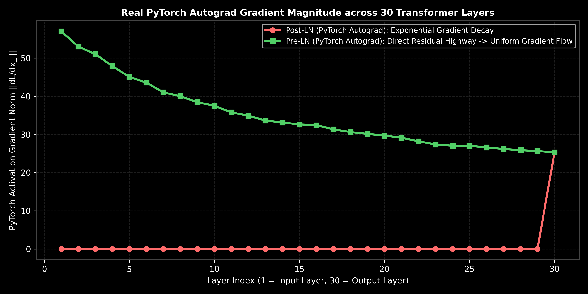

# Transformers: Complete Architecture & Block Dynamics

This guide details the complete Transformer architecture blocks (Encoder/Decoder), FFN projection dimensions, Residual Connections, Pre-LN vs. Post-LN, RMSNorm scaling, Causal/Padding masking matrices, and training vs. inference data flows.

> **Notebook Companion**: [06_transformer_architecture.ipynb](file:///d:/Study/Prep/machine-learning-prep/transformers/06_transformer_architecture.ipynb)

---

## 1. Complete Transformer Blocks

The Transformer is historically composed of an **Encoder** (bidirectional contextualization) and a **Decoder** (autoregressive generation).

```text
Transformer Layer   Core Sub-components                              Attention Mask Type
----------------------------------------------------------------------------------------------------------------------
Encoder Layer       Self-Attention -> Add & Norm -> FFN -> Add & Norm  Padding Mask Only
Decoder Layer       Masked Self-Attn -> Cross-Attn -> FFN -> Add & Norm Padding + Causal Mask
```

### A. Feed-Forward Network (FFN)
After the attention layers, each token's representation is projected to a higher-dimensional space and back using a Position-Wise FFN:
$$\text{FFN}(x) = \max\left(0, \ x W_1 + b_1\right) W_2 + b_2$$
- **Subspace Expansion:** Standard configurations project the embedding dimension $d_{\text{model}}$ to $4 \times d_{\text{model}}$ inside the hidden layer, adding capacity for non-linear feature interactions before projecting back.

### B. Residual Connections
Residual connections ($x + \text{SubLayer}(x)$) provide a gradient highway during backpropagation, bypassing deep non-linear layers and preventing vanishing gradients.

### C. Normalization Layering: Pre-LN vs. Post-LN
- **Post-LN (Original Transformer):** Normalizes *after* the residual addition:
  $$x_{t+1} = \text{LayerNorm}\left(x_t + \text{SubLayer}(x_t)\right)$$
  - *Production Limitation:* Gradients in early layers vanish, requiring a manual learning rate warm-up phase to prevent training from immediately diverging.
- **Pre-LN (Modern LLM Standard):** Normalizes the inputs *before* the sub-layers:
  $$x_{t+1} = x_t + \text{SubLayer}\left(\text{LayerNorm}(x_t)\right)$$
  - *Production Utility:* Extremely stable; training converges reliably without warm-up phases.



> [!NOTE]
> **Plot Interpretation & Interview Takeaways (Pre-LN vs. Post-LN Backpropagation Gradient Flow):**
> - **What is shown:** Real PyTorch autograd backpropagation gradient norms ($\|\nabla_{x_l} \mathcal{L}\|$) tracked across a 30-layer deep Transformer network.
> - **Key Mathematical Insight:** Post-LN applies LayerNorm *after* residual addition ($x_{l} = \text{Norm}(x_{l-1} + F(x_{l-1}))$), causing gradient norms to decay exponentially near early layers ($l \to 1$). Pre-LN applies LayerNorm *before* sub-layers ($x_l = x_{l-1} + F(\text{Norm}(x_{l-1}))$), creating an identity gradient highway $\frac{\partial x_L}{\partial x_l} = I + \sum \frac{\partial F}{\partial x_l}$ that maintains uniform gradient norms across all 30 layers.
> - **Interview Application:** Explains why modern LLMs use Pre-LN to train 70B+ parameter models reliably without delicate learning rate warmups.

---

## 2. Normalization Evolution: RMSNorm

To reduce computational overhead, modern architectures replace standard LayerNorm with **RMSNorm** (Root Mean Square Normalization).
- **LayerNorm:** Computes both mean $\mu$ and variance $\sigma^2$ to center and scale activations.
- **RMSNorm:** Assumes centering is redundant, scaling activations by their root mean square:
  $$\text{RMSNorm}(x) = \frac{x}{\text{RMS}(x)} \odot \gamma$$
  Where:
  $$\text{RMS}(x) = \sqrt{\frac{1}{D} \sum_{i=1}^D x_i^2 + \epsilon}$$
  - *Production Utility:* Removes the need to compute the mean, saving approximately **$10\%$ of computation overhead** per layer while matching LayerNorm's performance.

---

## 3. Masking Mechanics: Padding & Causal Masking

To prevent information leaks, we add masking layers to the attention logits before applying softmax:
- **Padding Mask:** Prevents attention heads from looking at padding tokens (added to make batch sizes uniform). We set padding token logits to $-\infty$ (which softmax rounds to $0.0$).
- **Causal Mask (Decoder Look-Ahead Mask):** Prevents the model from looking at future tokens during training (enforcing causality). We add a lower-triangular mask of $-\infty$ to the upper-right of the attention matrix:
  $$M_{\text{causal}} = \begin{bmatrix} 0 & -\infty & -\infty \\ 0 & 0 & -\infty \\ 0 & 0 & 0 \end{bmatrix}$$
  This ensures that when predicting the token at step $t$, the model can only attend to tokens at indices $\le t$.

---

## 4. Step-by-Step Hand Calculations: RMSNorm (Andrew Ng Style)

Normalize the activation vector $x = \begin{bmatrix} 1.0 & 2.0 & 3.0 \end{bmatrix}$ (dimension $D=3$) using RMSNorm with a scale parameter $\gamma = \begin{bmatrix} 1.0 & 1.0 & 1.0 \end{bmatrix}$ and $\epsilon = 0$:

1. **Calculate Squared Sum of Elements:**
   $$\sum_{i=1}^3 x_i^2 = 1.0^2 + 2.0^2 + 3.0^2 = 1.0 + 4.0 + 9.0 = 14.0$$
2. **Calculate Root Mean Square ($\text{RMS}(x)$):**
   $$\text{RMS}(x) = \sqrt{\frac{14.0}{3}} = \sqrt{4.6667} \approx \mathbf{2.1602}$$
3. **Normalize Activation Vector:**
   $$\hat{x} = \frac{x}{\text{RMS}(x)} = \frac{\begin{bmatrix} 1.0 & 2.0 & 3.0 \end{bmatrix}}{2.1602} \approx \begin{bmatrix} \mathbf{0.4629} & \mathbf{0.9258} & \mathbf{1.3887} \end{bmatrix}$$
4. **Apply Learnable Scale Parameter ($\gamma$):**
   $$y = \hat{x} \odot \gamma = \begin{bmatrix} 0.4629 & 0.9258 & 1.3887 \end{bmatrix} \odot \begin{bmatrix} 1.0 & 1.0 & 1.0 \end{bmatrix} = \begin{bmatrix} \mathbf{0.4629} & \mathbf{0.9258} & \mathbf{1.3887} \end{bmatrix}$$

**Result:** The normalized activation vector is $\begin{bmatrix} 0.4629 & 0.9258 & 1.3887 \end{bmatrix}$.

---

## 5. Production Scenario & Example

### Scenario: Deep Decoder Model Fails to Converge
You are pre-training a custom 34-layer decoder-only LLM. During early runs, the loss curve diverges (prints `NaN`) within the first 100 steps.
- **The Failure Mode:** Your architecture utilizes Post-LN layers. Because gradients unrolling through residual additions accumulate variance in early layers, weight updates saturate, causing backpropagation to overflow.
- **The Solution:** 
  1. You refactor the block layout to utilize **Pre-LN** structures, placing normalization before attention and FFN layers.
  2. You swap LayerNorm out for **RMSNorm** to speed up compute time.
  These updates stabilize the gradient signals, allowing you to train the deep network successfully without needing a long, sensitive learning rate warm-up phase.

---

## 6. PyTorch Transformer Block Implementation

This code implements a complete Pre-LN Transformer decoder layer with causal masking:

```python
import torch
import torch.nn as nn
import math

class RMSNorm(nn.Module):
    def __init__(self, dim, eps=1e-6):
        super().__init__()
        self.eps = eps
        self.gamma = nn.Parameter(torch.ones(dim))

    def forward(self, x):
        variance = x.pow(2).mean(-1, keepdim=True)
        return x * torch.rsqrt(variance + self.eps) * self.gamma

class TransformerDecoderLayer(nn.Module):
    def __init__(self, d_model, n_heads, d_ff):
        super().__init__()
        self.norm1 = RMSNorm(d_model)
        self.attn = nn.MultiheadAttention(d_model, n_heads, batch_first=True)
        
        self.norm2 = RMSNorm(d_model)
        self.ffn = nn.Sequential(
            nn.Linear(d_model, d_ff),
            nn.ReLU(),
            nn.Linear(d_ff, d_model)
        )
        
    def forward(self, x):
        # x shape: (B, T, d_model)
        batch_size, seq_len, _ = x.shape
        
        # 1. Setup Causal Mask
        # Upper triangular matrix of 1s (to mask) and 0s (to keep)
        mask = torch.triu(torch.ones(seq_len, seq_len), diagonal=1).bool().to(x.device)
        
        # 2. Pre-LN Self-Attention with Residual Addition
        x_norm = self.norm1(x)
        attn_out, _ = self.attn(x_norm, x_norm, x_norm, attn_mask=mask)
        x = x + attn_out
        
        # 3. Pre-LN FFN with Residual Addition
        x = x + self.ffn(self.norm2(x))
        
        return x

# Verify shapes
x = torch.randn(2, 5, 128)  # Batch=2, Seq=5, d_model=128
decoder = TransformerDecoderLayer(d_model=128, n_heads=4, d_ff=512)
out = decoder(x)
print("Decoder Layer Output Shape:", out.shape)  # Expected: (2, 5, 128)
```
