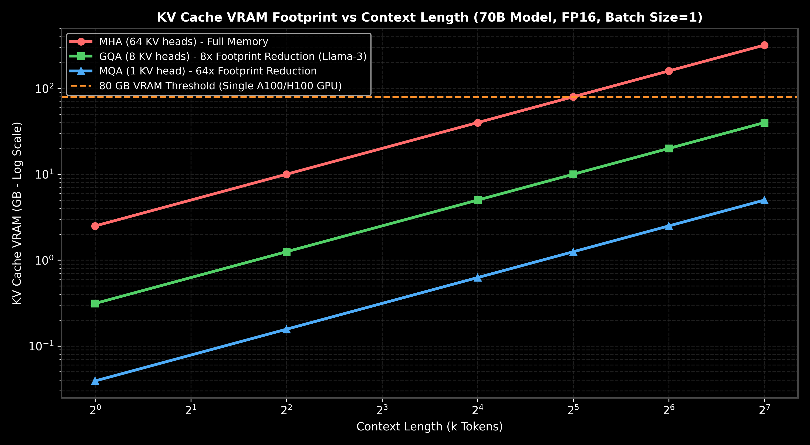
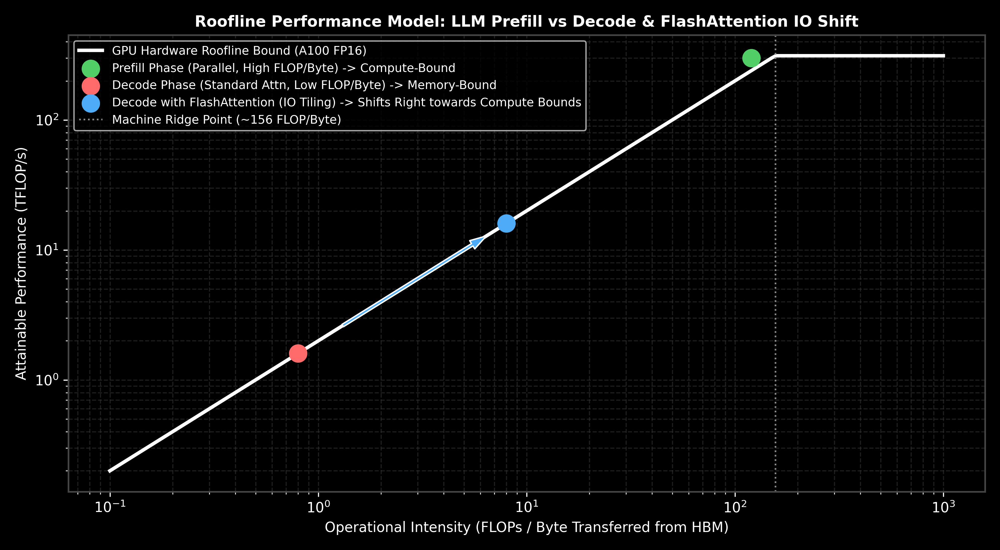

# Transformers: Inference Optimizations & KV Caching

This guide details the systems-level bottlenecks of autoregressive decoding, the prefill vs. decode phases, the KV Cache memory equation, FlashAttention hardware tiling, a step-by-step KV cache size hand-calculation, and throughput serving optimizations.

---

## 1. Autoregressive Decoding Phases

Autoregressive inference generates text token-by-token. This occurs in two distinct execution phases:

```text
Decoders Phase      Hardware Bottleneck       Compute Pattern                     Execution Efficiency
----------------------------------------------------------------------------------------------------------------------
Prefill Phase       Compute-Bound             Parallel (Processes prompt tokens)  High GPU Tensor Core utilization
Decode Phase        Memory-Bandwidth Bound   Sequential (Generates one token)    Low GPU execution efficiency
```

### A. The Prefill Phase (Parallel)
Processes the input prompt tokens in parallel to generate the initial hidden states and Key-Value representations. This is a compute-bound operation, leveraging GPU Tensor Cores efficiently.

### B. The Decode Phase (Sequential)
Generates subsequent tokens one-by-one. Each step reads the single newly generated token, projects it to QKV, retrieves the stored KV states of all prior tokens from GPU memory, runs self-attention, and updates the memory cache.
- **The Memory Bandwidth Bottleneck:** In the decode phase, the GPU execution cores sit idle most of the time because loading model parameters and historical KV cache tensors from High-Bandwidth Memory (HBM) to local registers takes much longer than the actual mathematical computations.

---

## 2. The KV Cache

During decoding, computing attention requires comparing the current token with all prior tokens in the sequence. To avoid re-calculating the key-value projections of all historical tokens at every step, we save them in memory as the **KV Cache**.

- **Why it is helpful:** It reduces the computation complexity of each decoding step from $O(T^2)$ to $O(T)$, significantly decreasing latency.
- **The Trade-off:** The KV cache grows linearly with batch size and context length, consuming gigabytes of VRAM.

### The KV Cache VRAM Formula
$$\text{Memory}_{\text{KV\_Cache}} = 2 \times P \times L \times H_{\text{KV}} \times d_{\text{head}} \times T \times B \text{ bytes}$$

Where:
- **$2$** represents storing both Key and Value matrices.
- **$P$** is the precision weight scale (e.g., $2$ bytes for FP16/BF16, $1$ byte for INT8).
- **$L$** is the number of transformer layers.
- **$H_{\text{KV}}$** is the number of Key-Value attention heads.
- **$d_{\text{head}}$** is the dimensionality of each head.
- **$T$** is the target sequence context length.
- **$B$** is the serving batch size.



---

## 3. FlashAttention: Hardware Tiling & Online Softmax

Standard self-attention is **memory-bandwidth bound**. This is because it materializes and transfers the intermediate $N \times N$ attention matrix back and forth between slow GPU High-Bandwidth Memory (HBM) and fast local GPU Cache/SRAM multiple times.

### A. GPU Memory Hierarchy & Hardware Realities
GPU architectures are divided into different memory layers with drastically different capacities, latencies, and bandwidths:

```text
Memory Layer   Capacity (A100 GPU)   Bandwidth / Access Speed   Latency
----------------------------------------------------------------------------------------------------------------------
HBM (Global)   40GB / 80GB           ~1.5 - 2.0 TB/s            High (400 - 800 clock cycles)
SRAM (Local)   ~20 MB (Shared)       ~19 TB/s                   Low (20 - 30 clock cycles)
Registers      ~256 KB (Per SM)      Ultra-Fast                 1 clock cycle
```

In standard self-attention:
1. Load $Q$ and $K$ from HBM $\to$ compute $S = Q K^T$ in SRAM $\to$ write $S$ of size $N \times N$ back to HBM (Memory Bound).
2. Load $S$ from HBM $\to$ compute $P = \text{softmax}(S)$ in SRAM $\to$ write $P$ of size $N \times N$ back to HBM (Memory Bound).
3. Load $P$ and $V$ from HBM $\to$ compute $O = P V$ in SRAM $\to$ write $O$ back to HBM (Memory Bound).



### B. The FlashAttention Solution: Tiling & Online Softmax
FlashAttention resolves this by loading $Q, K, V$ into SRAM in small tiles/blocks, computing attention locally, and writing only the final output $O$ back to HBM. It completely bypasses HBM accesses for the intermediate $N \times N$ matrix.

#### The Challenge: Softmax Global Dependency
Standard softmax requires knowing the global maximum of the entire row to prevent numerical overflow:
$$\text{softmax}(x)_i = \frac{e^{x_i - m}}{\sum_{j=1}^N e^{x_j - m}}, \quad \text{where } m = \max_{j=1..N} x_j$$
This requires loading the entire row of $QK^T$ to find the maximum before scaling, preventing block-by-block incremental calculation.

#### The Solution: Online Softmax Block Updates
FlashAttention implements **online softmax** to calculate softmax incrementally block-by-block. Let a row $x$ be partitioned into two blocks: $x = [x^{(1)}, x^{(2)}]$.

1. **Process Block 1 ($x^{(1)}$):**
   - Compute local maximum: $m^{(1)} = \max(x^{(1)})$
   - Compute local sum of exponentials: $d^{(1)} = \sum_i e^{x_i^{(1)} - m^{(1)}}$
   - Compute local attention output: $O^{(1)} = \frac{1}{d^{(1)}} \sum_i e^{x_i^{(1)} - m^{(1)}} V_i^{(1)}$

2. **Process Block 2 ($x^{(2)}$) and Merge:**
   - Compute local maximum of block 2: $m^{(2)} = \max(x^{(2)})$
   - Compute the new global maximum:
     $$m^{(new)} = \max\left(m^{(1)}, \ m^{(2)}\right)$$
   - Compute the updated scaling factor sum $d^{(new)}$:
     $$d^{(new)} = d^{(1)} e^{m^{(1)} - m^{(new)}} + d^{(2)} e^{m^{(2)} - m^{(new)}}, \quad \text{where } d^{(2)} = \sum_i e^{x_i^{(2)} - m^{(2)}}$$
   - Rescale and merge the outputs to get the final attention output $O^{(new)}$:
     $$O^{(new)} = \frac{d^{(1)} e^{m^{(1)} - m^{(new)}} O^{(1)} + e^{m^{(2)} - m^{(new)}} \left( \sum_i e^{x_i^{(2)} - m^{(2)}} V_i^{(2)} \right)}{d^{(new)}}$$

By scaling the prior block's output $O^{(1)}$ by $e^{m^{(1)} - m^{(new)}}$, we dynamically adjust the exponent scaling to match the new global maximum $m^{(new)}$. This allows FlashAttention to loop through blocks of $K$ and $V$ and accumulate the exact mathematical attention output directly in registers/SRAM.

### C. Backward Pass Recomputation
During backpropagation, standard attention reads the stored $N \times N$ attention matrix $P$ from HBM to compute gradients. FlashAttention avoids this HBM transfer:
- It only stores the block scaling statistics ($m, d$) in HBM during the forward pass.
- In the backward pass, it recomputes the attention matrix tiles $P$ on-the-fly in fast SRAM from $Q, K, V$ tiles loaded from HBM.
- Since computing FLOPs in SRAM is much faster than waiting for memory transactions from HBM, this recomputation yields a **$2\text{x} - 4\text{x}$ speedup** while reducing the VRAM footprint from $O(N^2)$ to $O(N)$.

---

## 4. Step-by-Step Hand Calculations: KV Cache Size (Andrew Ng Style)

Let's calculate the VRAM requirements of the KV Cache for a standard **Llama-2-7B** model under production serving conditions:
- **Configurations:**
  - Number of Layers ($L$) = $32$
  - Number of KV heads ($H_{\text{KV}}$) = $32$
  - Head dimension ($d_{\text{head}}$) = $128$
  - Context Length ($T$) = $2048$ tokens
  - Batch Size ($B$) = $4$
  - Precision = FP16 ($P = 2$ bytes)

---

### Step 1: Compute Parameters per Token per Layer
Each token requires storing both Key and Value vectors:
$$\text{Values} = 2 \times H_{\text{KV}} \times d_{\text{head}} = 2 \times 32 \times 128 = 8,192 \text{ float values}$$

---

### Step 2: Scale across all Layers
$$\text{Values}_{\text{Total}} = L \times \text{Values} = 32 \times 8,192 = 262,144 \text{ float values per token}$$

---

### Step 3: Scale across Batch and Context Length
$$\text{Values}_{\text{Batch}} = 262,144 \times T \times B = 262,144 \times 2048 \times 4 = 2,147,483,648 \text{ values}$$

---

### Step 4: Convert to Bytes using Precision ($P=2$)
$$\text{Memory}_{\text{Bytes}} = \text{Values}_{\text{Batch}} \times P = 2,147,483,648 \times 2 = 4,294,967,296 \text{ bytes}$$
$$\text{Memory}_{\text{Gigabytes}} = \frac{4,294,967,296}{1,073,741,824} = \mathbf{4.00 \text{ GB}}$$

**Result:** Storing key-value states for a small batch size of 4 consumes exactly **$4.00\text{ GB}$ of VRAM**.

---

## 5. Production Scenario & Example

### Scenario: Scaling chatbot API latency under concurrent loads
You deploy a customer-facing LLM API. During peak hours, as concurrent batch loads grow, output generation latency spikes from $30$ tokens/sec to $2$ tokens/sec, violating SLA latency agreements.
- **The Failure Mode:** The system memory is saturated. The GPU must constantly page segments of the KV cache in and out of GPU memory (HBM) to process concurrent requests, causing severe memory bandwidth bottlenecks.
- **The Solution:** 
  1. You enable **vLLM PagedAttention**, which allocates KV cache memory dynamically in non-contiguous physical memory pages (like virtual memory in operating systems), preventing fragmentation and saving up to $96\%$ of wasted cache space.
  2. You implement **INT8 Quantization** on the KV cache, halving the memory footprint to $2\text{GB}$ and doubling generation throughput.

---

## 6. PyTorch Mock KV Cache Update Loop

This code demonstrates how Key-Value tensors are cached and retrieved during decode iterations:

```python
import torch
import torch.nn as nn

class KVDecoderBlock(nn.Module):
    def __init__(self, d_model, n_heads):
        super().__init__()
        self.n_heads = n_heads
        self.d_k = d_model // n_heads
        self.q_proj = nn.Linear(d_model, d_model, bias=False)
        self.k_proj = nn.Linear(d_model, d_model, bias=False)
        self.v_proj = nn.Linear(d_model, d_model, bias=False)

    def forward(self, x, kv_cache=None):
        # x shape: (B, 1, d_model) - single decode token input
        batch_size = x.shape[0]
        
        # 1. Project current token representation
        q = self.q_proj(x).view(batch_size, 1, self.n_heads, self.d_k).transpose(1, 2)
        k_new = self.k_proj(x).view(batch_size, 1, self.n_heads, self.d_k).transpose(1, 2)
        v_new = self.v_proj(x).view(batch_size, 1, self.n_heads, self.d_k).transpose(1, 2)
        
        # 2. Update KV Cache
        if kv_cache is not None:
            k_cached, v_cached = kv_cache
            # Concatenate along the token sequence dimension
            k = torch.cat([k_cached, k_new], dim=-2)
            v = torch.cat([v_cached, v_new], dim=-2)
        else:
            k = k_new
            v = v_new
            
        current_cache = (k, v)
        
        # 3. Compute Attention
        scores = torch.matmul(q, k.transpose(-2, -1)) / math.sqrt(self.d_k)
        weights = torch.softmax(scores, dim=-1)
        output = torch.matmul(weights, v)
        
        return output, current_cache

# Mock Decode Loop
batch, d_model, n_heads = 1, 64, 4
decoder = KVDecoderBlock(d_model, n_heads)

x_token1 = torch.randn(batch, 1, d_model)
x_token2 = torch.randn(batch, 1, d_model)

# Decoding step 1 (generates cache)
out1, cache = decoder(x_token1)
print("Step 1 Cache Shapes (Key, Value):", cache[0].shape, cache[1].shape)

# Decoding step 2 (uses cache)
out2, cache = decoder(x_token2, kv_cache=cache)
print("Step 2 Cache Shapes (Key, Value):", cache[0].shape, cache[1].shape)
```
