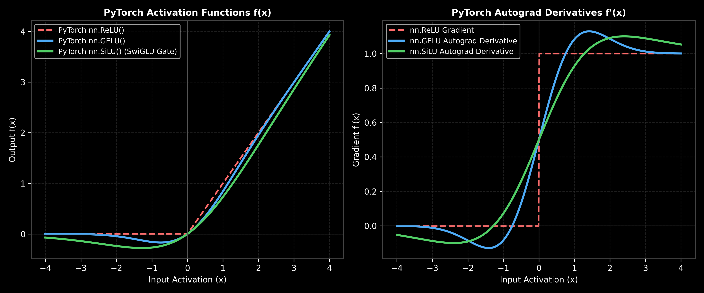

# Transformers: Modern Architectures (SwiGLU, MoE & context extensions)

This guide details the evolution of modern Large Language Model (LLM) architectures (such as Llama-3, Mistral, and Mixtral), explaining the mathematical changes behind SwiGLU and Mixture of Experts (MoE), walking through a SwiGLU hand-calculation, and detailing their production systems tradeoffs.

> **Notebook Companion**: [09_modern_transformer_architectures.ipynb](file:///d:/Study/Prep/machine-learning-prep/transformers/09_modern_transformer_architectures.ipynb)

---

## 1. How Modern LLMs Differ from the Original Transformer

Modern LLMs are built on the original Transformer architecture but introduce key optimizations to stabilize training and improve inference speed:

```text
Architectural Component   Original Transformer (Attention Is All You Need)   Modern LLMs (Llama-3, Mistral)
----------------------------------------------------------------------------------------------------------------------
Normalization Layering    Post-LN (Norm after residuals)                     Pre-LN (Norm before sub-layers)
Normalization Engine      LayerNorm (Requires mean calculation)              RMSNorm (Root Mean Square scale only)
Activation Function       ReLU (FFN)                                         SwiGLU (Gated Linear Units)
Positional Encoding       Absolute Sinusoidal Embeddings                    Rotary Positional Embeddings (RoPE)
Attention Mechanism       Multi-Head Attention (MHA)                         Grouped-Query Attention (GQA)
```

---

## 2. Activation Function Evolution: ReLU -> GELU -> SwiGLU

Activation functions in FFN sub-layers have evolved to provide smoother gradient paths and prevent dead neurons during backpropagation:

### A. ReLU (Rectified Linear Unit)
$$\text{ReLU}(x) = \max(0, x)$$
- **Limitations:** For any input $x < 0$, the gradient is exactly $0.0$. If a neuron's weights shift such that it is inactive for all inputs in the dataset, it will never receive gradient updates, a failure mode known as the **dying ReLU problem**.

### B. GELU (Gaussian Error Linear Unit)
GELU scales the input $x$ by the cumulative distribution function (CDF) of the standard normal distribution $\Phi(x)$:
$$\text{GELU}(x) = x \cdot \Phi(x) = x \cdot P(X \le x), \quad X \sim \mathcal{N}(0, 1)$$
Since the exact CDF is computationally expensive to evaluate, we use the standard fast approximation:
$$\text{GELU}(x) \approx 0.5x \left(1 + \tanh\left(\sqrt{\frac{2}{\pi}} \left(x + 0.044715 x^3\right)\right)\right)$$
- **Why it works:** Unlike ReLU, GELU is non-monotonic and smooth. For negative inputs, it retains a small, non-zero gradient that gradually decays to zero as $x \to -\infty$. This prevents the dying neuron problem and allows networks to learn complex representations more easily, making it the default in models like BERT, GPT-2, and ViT.

### C. SwiGLU (Swish Gated Linear Unit)
SwiGLU is a Gated Linear Unit where the gating path is activated by a Swish function ($\text{Swish}_\beta(z) = z \cdot \sigma(\beta z)$):
$$\text{SwiGLU}(x) = \text{Swish}_\beta(x W) \odot x V$$
Where $W$ and $V$ are projection weights, and $\odot$ is the element-wise product.
- **Why it works:** It splits the feed-forward projection into two parallel paths, multiplying them element-wise. This bilinear gating allows the model to learn multiplicative relationships between features. Despite having $50\%$ more parameters for the same hidden dimension size, SwiGLU shows significantly better convergence rates than GELU/ReLU.



> [!NOTE]
> **Plot Interpretation & Interview Takeaways (ReLU vs. GELU vs. SwiGLU):**
> - **What is shown:** Left: Activation outputs $f(x)$. Right: PyTorch autograd derivatives $f'(x)$ for $x \in [-4, 4]$ across ReLU, GELU, and SiLU/SwiGLU.
> - **Key Mathematical Insight:** ReLU outputs exact zero for $x < 0$ with zero derivative ($f'(x) = 0$), causing "dying ReLU" neurons. GELU ($\text{GELU}(x) = x \Phi(x)$) and SiLU ($\text{SiLU}(x) = x \sigma(x)$) are smooth and non-monotonic, maintaining negative gradients that allow inactive neurons to recover during training.
> - **Interview Application:** Explains why modern architectures (GPT-4, Llama-3) replaced ReLU with GELU/SwiGLU to accelerate training convergence and improve feature representations.

---

## 3. LayerNorm Placement & Gradient Stability: Post-LN vs. Pre-LN

The placement of Layer Normalization in the residual block determines the gradient flow characteristics of deep networks.

### A. Post-LN (Original Transformer)
In Post-LN, normalization is applied *after* the residual addition:
$$x_{l} = \text{LayerNorm}\left(x_{l-1} + F(x_{l-1})\right)$$
- **Vanishing Gradients Proof:** 
  When backpropagating from the output layer $L$ to layer $l$, the gradient chain rule is:
  $$\frac{\partial x_L}{\partial x_l} = \prod_{k=l+1}^L \frac{\partial x_k}{\partial x_{k-1}}$$
  Because normalization is on the outer loop, the magnitude of the activation $x_{l-1} + F(x_{l-1})$ grows with depth, causing the scale parameter of LayerNorm to scale down gradients inversely with the norm:
  $$\frac{\partial \text{LayerNorm}(y)}{\partial y} \approx \frac{1}{\sigma_y} \left(I - \frac{1}{d} \mathbf{1}\mathbf{1}^T\right)$$
  As depth increases, $\sigma_y$ grows, scaling down the gradients exponentially at early layers ($l \to 0$). This necessitates a highly sensitive **learning rate warmup phase** to prevent early training divergence.

### B. Pre-LN (Modern LLM Standard)
In Pre-LN, normalization is applied to the sub-layer input *before* processing:
$$x_{l} = x_{l-1} + F\left(\text{LayerNorm}(x_{l-1})\right)$$
- **Stable Gradients Proof:**
  We can expand the recurrence relation for any final layer $L$ directly:
  $$x_L = x_l + \sum_{k=l}^{L-1} F\left(\text{LayerNorm}(x_k)\right)$$
  Taking the partial derivative with respect to $x_l$:
  $$\frac{\partial x_L}{\partial x_l} = I + \sum_{k=l}^{L-1} \frac{\partial F\left(\text{LayerNorm}(x_k)\right)}{\partial x_l}$$
  The identity matrix term $I$ is preserved directly in the derivative. This ensures that gradients flow back to early layers directly through the residual "highway" without exponential decay, even if the sub-layer gradients are very small. This eliminates the dependency on complex learning rate warm-up schedules.

---

## 4. Mixture of Experts (MoE)

Instead of passing every token through the same static FFN block, MoE models contain a collection of $E$ independent "expert" FFN networks ($E_1, \dots, E_E$) and a **Gating/Router Network** $G(x)$.

The gating network outputs routing weights for each expert, selecting only the top-$k$ experts (typically $k=2$) to process the token:
$$y = \sum_{i \in \text{top-k}} G(x)_i E_i(x)$$

- **Conditional Computation:** Only the selected $k$ experts are activated for a given token. 
- **Production Utility:** Allows models to scale their parameter capacity (e.g. up to 100B+ parameters) while only activating a subset of them (e.g. 12B active parameters) per token, keeping the compute cost ($O(\text{active params})$) low.

---

## 4. Step-by-Step Hand Calculations: SwiGLU Activation (Andrew Ng Style)

Let's evaluate SwiGLU on a single scalar input $x = 1.0$ with $\beta=1.0$ and parameters:
- $W = [2.0]$ | $V = [0.5]$ | Biases = $0$

1. **Compute Projections:**
   $$x W = 1.0 \times 2.0 = 2.0$$
   $$x V = 1.0 \times 0.5 = 0.5$$
2. **Compute Swish Gate Output ($\text{Swish}(2.0)$):**
   $$\text{Swish}(2.0) = \frac{2.0}{1 + e^{-2.0}} \approx \frac{2.0}{1 + 0.1353} = \frac{2.0}{1.1353} \approx \mathbf{1.7616}$$
3. **Compute Final SwiGLU Output:**
   $$\text{SwiGLU}(x) = \text{Swish}(2.0) \times (x V) = 1.7616 \times 0.5 = \mathbf{0.8808}$$

**Result:** The SwiGLU activation output is **$0.8808$**.

---

## 5. Production Scenario & Example

### Scenario: Deploying Mixtral-8x7B (MoE) under high throughput constraints
You deploy a Mixtral-8x7B model (which contains 47B total parameters and activates 13B parameters per token) on an edge server node.
- **The Failure Mode:** During peak loads, GPU utilization is low, and routing calculations introduce significant latency overhead. Profiling shows that since different tokens are routed to different experts, the workload cannot be batched efficiently (known as **expert capacity skew**). Some experts sit idle while others are overloaded.
- **The Solution:** 
  1. You enable **capacity factor routing limits** that drop tokens if an expert receives more than its fair share of inputs, routing them to the next best expert.
  2. You configure **tensor parallelism** to split experts across GPUs, reducing HBM transfer overhead and keeping serving latency within SLA bounds.

---

## 6. PyTorch SwiGLU Implementation

This code implements a SwiGLU FFN layer in PyTorch:

```python
import torch
import torch.nn as nn
import torch.nn.functional as F

class SwiGLUFFN(nn.Module):
    def __init__(self, d_model, d_ff):
        super().__init__()
        # We need three projection weight matrices: W, V, and Output
        self.w = nn.Linear(d_model, d_ff, bias=False)
        self.v = nn.Linear(d_model, d_ff, bias=False)
        self.out_proj = nn.Linear(d_ff, d_model, bias=False)

    def forward(self, x):
        # x shape: (B, T, d_model)
        
        # 1. Compute parallel projections
        proj_w = self.w(x)  # (B, T, d_ff)
        proj_v = self.v(x)  # (B, T, d_ff)
        
        # 2. Apply Swish activation to the gate path (W)
        # silu is PyTorch's native Swish function: x * sigmoid(x)
        gate = F.silu(proj_w)
        
        # 3. Combine gating and value paths (V)
        # Element-wise multiplication
        gated_activation = gate * proj_v  # (B, T, d_ff)
        
        # 4. Project back to model dimension
        return self.out_proj(gated_activation)

# Verify shapes
x = torch.randn(2, 5, 128)  # Batch=2, Seq=5, d_model=128
ffn = SwiGLUFFN(d_model=128, d_ff=256)
out = ffn(x)
print("SwiGLU FFN Output Tensor Shape:", out.shape)  # Expected: (2, 5, 128)
```
